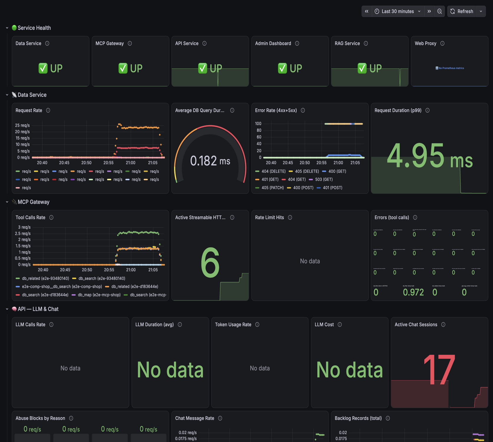
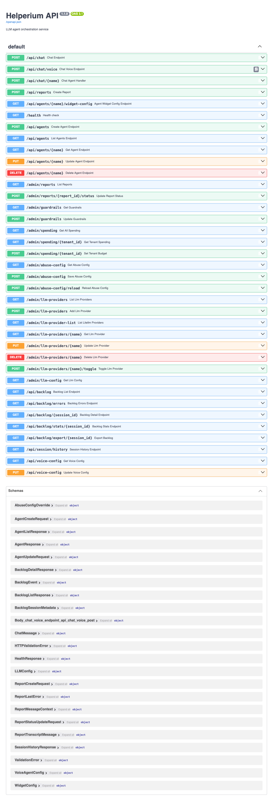
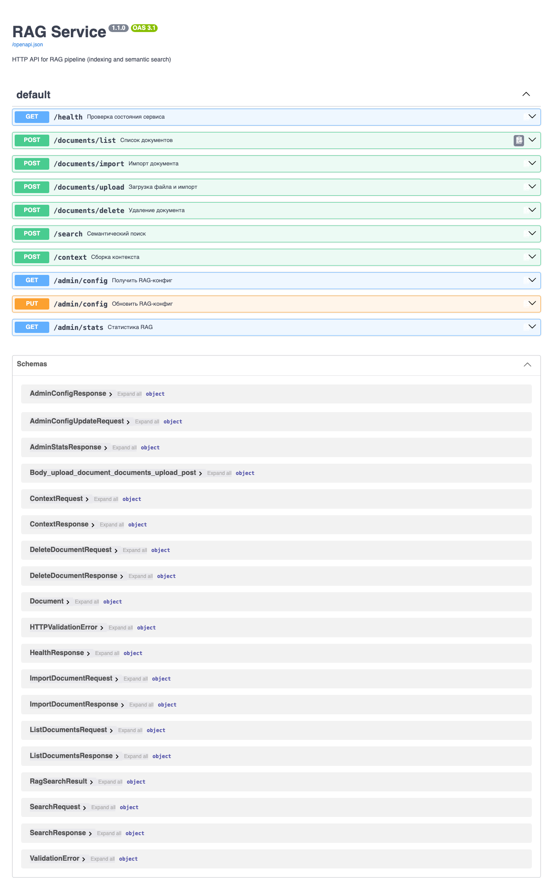
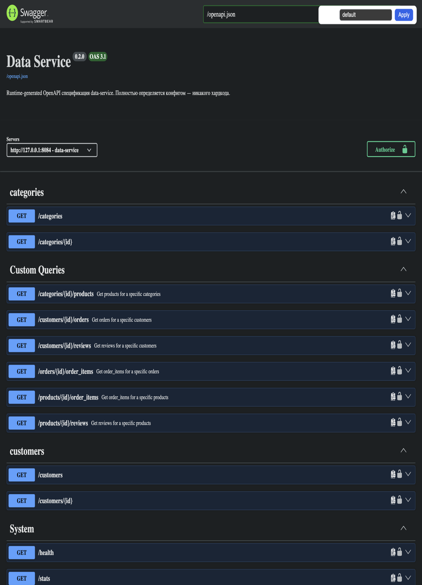

# Helperium


🇷🇺 [Читать на русском](README_RU.md)

Self-hosted AI agent platform for any organization with a SQL database. An online shop connects its product catalog - a store owner asks "how are orders distributed across statuses?" and the agent runs three MCP tool calls (discover the schema, filter each status), then answers "delivered: 4, shipped: 2" in 10 seconds, with the catalog never leaving the shop's read-only PostgreSQL role. A university's student records or a logistics company's warehouse DB connects the same way.

No code per database. No sending proprietary data to third-party clouds.

## Contents

[Overview](#overview) · [Quick Start](#quick-start) · [Screenshots](#screenshots) · [Core Capabilities](#core-capabilities) · [Architecture](#architecture) · [Security Model](#security-model) · [Deployment](#deployment) · [Testing and CI](#testing-and-ci) · [Embedded Widget](#embedded-widget) · [About the docs](#about-the-docs) · [License](#license-and-commercial-support)

## Quick Start

```bash
git clone https://github.com/trash2bin/helperium
cd helperium
cp .env.example .env
uv sync
ollama pull qwen2.5:0.5b
./infra/scripts/dev.sh start
open http://127.0.0.1:8080
```

Set a strong `ADMIN_TOKEN` in `.env` before starting — the admin dashboard (`:8085`) stays locked without it. Docker deployment, production profiles, and LLM provider registration: [Deployment](#deployment).

## Overview

Unlike static RAG systems that require manual re-indexing, every answer is built at question time: Helperium introspects the connected schema, auto-generates the tool surface from it, and the agent queries live data in read-only mode. The business owner decides which tables, columns, and operations the agent can see, from an administrative dashboard. The LLM layer runs locally on GPU-equipped hardware or routes through any OpenAI-compatible provider. How the services split this work: [Architecture](#architecture).

## Screenshots

| Storefront with widget | Admin Dashboard - problem reports |
|---|---|
|  |  |

The storefront in the first column is not part of the platform: `demo/autoparts-store` is a self-contained Django demo shipped in the repo so the widget has a real-looking shop to live on. It runs its own stack behind its own Caddy, connects to Helperium as a regular tenant, and processes no payments. How to run and deploy it: [its README](demo/autoparts-store/README.md).

| Django storefront with the embedded widget |
|---|
|  |

### Admin Panels

| Tenants list | Tenant config - entities & endpoints |
|---|---|
|  |  |

| Tools & write approval | Agents |
|---|---|
|  |  |

| RAG document management | Anti-Abuse settings |
|---|---|
|  |  |

### Monitoring

| Grafana Dashboard (32 panels) - full-page overview of all service metrics |
|---|
|  |

## Core Capabilities

- **Live SQL introspection.** Connects to SQLite or PostgreSQL. Rescanning a schema regenerates the tool surface, so database changes need no code changes. What the model sees is `filter_{entity}` per entity plus six consolidated tools (`db_map`, `db_describe`, `db_search`, `db_filter`, `db_get`, `db_related`); `get_*`, `count_*`, and `distinct_*` exist but stay off until enabled per tenant in `LLMToolPolicy`.
- **Read-only by default.** Write endpoints are filtered out when the tenant config is built, so they never reach the MCP manifest and the model cannot call what it cannot see. The mechanism is in [Security Model](#security-model).
- **Domain-agnostic.** Works with any schema - product catalogs, student records, patient data, inventory, orders. The agent adapts to whatever tables and columns it finds.
- **Hybrid retrieval.** Combines live SQL queries with vector search over uploaded documents (PDF, TXT, MD, DOCX). Documents are chunked, embedded, and cached. Re-embedding pipelines handle updates without full re-indexing.
- **Embeddable widget.** One `<script>` tag, no framework on the host side, no CSS conflicts. Details in [Embedded Widget](#embedded-widget).
- **Administrative control.** Per tenant: toggle entities on/off, rename fields for business context, rewrite the descriptions the agent reads, enable or disable individual endpoints, pick the LLM provider and model per client, set anti-abuse guardrails.
- **Observability.** Prometheus metrics on every service feed a Grafana dashboard; `correlation_id` ties a visitor session together across services.

## Architecture

The platform started as a single FastAPI app that talked to Postgres and OpenAI. Two things forced it apart: the read-only tenant requirement, where one customer database user can never touch another customer's tables even by mistake, and the LLM provider churn, where every model has a slightly different tool-calling dialect. Splitting the services gave both constraints a place to live.

```
Browser (Embed Widget → POST /api/chat/{name}
 JS script, Shadow DOM)
 |
 v
 api:8081 (FastAPI + LiteLLM) → SSE stream → Widget
 |
 | call_tool() via Streamable HTTP /mcp
 v
 mcp-gateway:8083 (Go, MCP server)
 |\
 | \-- HTTP --> rag:8082 (Python, ChromaDB) - optional,
 |              document tools served through the gateway
 |
 | HTTP (admin API) + /mcp (MCP client)
 v
 data-service:8084 (Go, config-driven query)
 |
 | SQL (prepared statements, read-only by default)
 v
 Client DB (SQLite / PostgreSQL)
```

### The request path

A visitor's browser loads the embed widget from api-service. The widget opens `POST /api/chat/{agent}` and gets back an SSE stream. **The widget bypasses demo/web entirely** - `demo/web` is a development convenience, not an entry point.

For each turn, api-service calls the LLM via LiteLLM and parses native `tool_calls` from the response. Text is treated as final assistant text by default: a reply that merely looks like a tool call is not executed unless it came back as a structured field, which keeps a misbehaving model from talking itself into a write. The one exception is a strict compatibility parser that a verified provider/model policy may opt into, for models that emit an exact tool call as fenced JSON instead of using the native field. Every tool call is then a Streamable HTTP request to `mcp-gateway /mcp` with `X-Tenant-ID` taken from the agent's server-stored config - the browser never sets tenant scope. mcp-gateway validates the API key, the origin allow-list, and the tenant scope, then routes to data-service over its internal HTTP API.

data-service resolves the tenant's adapter (Postgres or SQLite), runs the tool, and returns structured rows. The result flows back through the gateway, into the LLM, and out as a `final` SSE event. **The `final` event is buffered and inspected by the output guard before the widget sees it** - the widget never renders a partial answer, only a guarded complete one. The same `correlation_id` is threaded through every event in the chain.

We chose SSE over WebSocket because the chat stream is one-way (server to client) and SSE traverses HTTP/2, CDNs, and reverse proxies without an upgrade handshake.

The [api-service guide](services/api-service/README.md) covers the chat loop and SSE events. Cross-service wiring and the `X-Tenant-ID` propagation rules are not in any single service README - they live in the [api-flow doc](doc/api-flow.md) and the [api-contracts doc](doc/agents/api-contracts.md).

### The data layer

data-service exposes three search strategies - `grep` (multi-token AND text with regex), `filter` (field-based with `field__gt`, `__like`, `__in` operators), and `schema` (metadata discovery with distinct values and numeric ranges) - plus `custom_queries`, which are pre-approved `SELECT` statements configured per tenant. Those names are the service's own query surface; the model is never handed them, only the generated tools listed under [Core Capabilities](#core-capabilities).

Isolation is enforced at the PostgreSQL role, not only at the application layer. Each tenant gets a dedicated role with only `CONNECT`, `USAGE` on the schema, and `SELECT` on the catalog tables. The writer credentials never leave the database server; only the read-only DSN reaches data-service. The original design had a single `read_only: true` config flag at the adapter layer, and we had to abandon it: an LLM that knows `UPDATE` is valid SQL will eventually call `UPDATE` in a `custom_query`, and the adapter-level flag was the wrong place to draw the line. Per-tenant roles fix it at the database, where SQL permissions are the same on every connection and every query.

SQLite tenants get the same isolation a different way: a per-tenant file, opened by data-service with a connection that has no write privilege on the OS layer. The adapter is the same; the transport differs.

The [data-service guide](services/data-service/README.md) covers the adapter layout, endpoints, and config generation; the per-strategy detail it defers to lives in the [search-strategies doc](doc/agents/search-strategies.md).

### Admin, web, and observability

**Admin Dashboard** (`:8085`, Go backend + Alpine.js) manages tenant lifecycle, agents, abuse settings, RAG, and the reports review page. It talks to api-service and data-service directly via authenticated admin API; it does not pass through mcp-gateway. RBAC is `admin` vs `viewer` (viewer is a read-only token with no write or reload capability). Service guide: [admin-dashboard README](services/admin-dashboard/README.md).

**rag** (`:8082`, Python, ChromaDB) is optional and reaches the agent only through the gateway: when the service responds to its health check, mcp-gateway registers `search_documents`, `list_documents`, and `get_rag_context`; when it is down, those tools are absent and the agent keeps answering from SQL alone. Embeddings are local via Sentence Transformers or remote via any OpenAI-compatible endpoint; ChromaDB is the vector store.

**Prometheus metrics** on every core service — api, rag, mcp-gateway, data, admin; each behind bearer auth, the dev-only web proxy has none (request count, SSE event count, tool-call latency, LLM call latency, abuse counters) feed a 32-panel Grafana dashboard covering request rates, LLM calls by model, tool invocations, token usage, RAG search rates, cache hit ratios, and active SSE sessions; see the [monitoring doc](doc/monitoring.md). Structured logs carry a `correlation_id` from the widget's `X-Correlation-ID` header through api-service, mcp-gateway, and data-service, so a single visitor session traces end to end. An OTel exporter is a drop-in; no service code changes are required.

### Stack and operations

- **Python 3.12-3.13** for AI workloads: api-service, rag, embed widget serving, demo/web. FastAPI, Pydantic v2, LiteLLM, Sentence Transformers, ChromaDB client.
- **Go 1.26** for mechanical workloads: mcp-gateway, data-service, admin-dashboard backend. `net/http`, `pgx/v5`, `sqlx`, the official MCP SDK, one Go module per service.
- **SQLite** for zero-config local development and single-tenant deployments; **PostgreSQL 16+** for production multi-tenant.
- **Docker Compose** with profile-based E2E (`infra/scripts/compose.sh --profile test`) that swaps in test-only secure MCP/API credentials and explicit `MCP_ALLOWED_ORIGINS`.

Run scripts: [dev.sh](infra/scripts/dev.sh) (native dev), [compose.sh](infra/scripts/compose.sh) (Docker). Anti-abuse counters (`max_user_turns_per_session`, `min_interval_ms`, message size, rate per IP) are server-side per session and the browser cannot reset them; the admin dashboard owns the persisted policy.

### API surfaces and debug tooling

Every service in the chat path exposes an OpenAPI schema (api, rag, data, gateway), and the gateway has a debug playground for firing tool calls at a tenant by hand.

| API Swagger (api-service) | RAG Swagger (rag-service) |
|---|---|
|  |  |

| Data Service Swagger UI | MCP Gateway Debug Playground |
|---|---|
|  |  |

The Swagger UI pages are opt-in via environment variables and unauthenticated when enabled, so they are for local work only: `API_ENABLE_DOCS=1` for api-service, `API_ENABLE_DOCS=1` for rag-service, `DOCS_ENABLED=1` for data-service. The gateway debug playground answers behind `MCP_API_KEY`. The contract without the flag: [`specs/api.openapi.yaml` contract](specs/api.openapi.yaml).

## Security Model

- **Read-only enforcement.** The data-service router skips write endpoints (`POST`/`PUT`/`PATCH`/`DELETE`) when the tenant's `read_only` flag is `true`, so the MCP manifest only contains read tools. An admin who needs writes flips the flag per tenant and registers the write endpoint explicitly.
- **Output guard.** The `final` answer is buffered and inspected before the widget ever sees it, so the widget renders only a guarded complete reply; the flow is described in [The request path](#the-request-path).
- **Pentest coverage.** A security checklist is maintained in the [security-isolation doc](doc/agents/security-isolation.md) (see also anti-abuse and tool-call safety layers in the same `doc/agents/` directory).
- **Tenant isolation.** Three layers are enforced and verified in CI under concurrent load:

 | Layer | Mechanism |
 | --- | --- |
 | Data | Per-tenant SQLite files or per-tenant PostgreSQL role with `SELECT`-only grants |
 | Tools | MCP tools registered with tenant ID in closure; the gateway never accepts tenant scope from the browser |
 | Consumer | `X-Tenant-ID` header propagated from api-service to mcp-gateway; api-service resolves tenant from the server-stored agent config |

 Composite mode lets a single SSE session route across N tenants with prefixed tool names (`{tenantID}__tool_name`) for conflict-free resolution.
- **Abuse limits.** Rate per IP, `min_interval_ms`, message size, and `max_user_turns_per_session` are enforced server-side per session and cannot be reset by the browser; the mechanism and the persisted policy are covered in [Stack and operations](#stack-and-operations) and the [anti-abuse doc](doc/agents/anti-abuse.md).
- **Widget hardening.** The embed endpoint sets `X-Content-Type-Options: nosniff`, `X-Frame-Options: DENY`, and long-lived immutable cache headers for static assets. Content Security Policy requirements are documented for host sites.

## Deployment

### Docker Compose (recommended for production)

```bash
cp .env.example .env
# The MCP gateway fails closed without credentials. Generate two DISTINCT strong
# secrets (native dev mints an ephemeral key automatically, Docker does not):
MCP_API_KEY=$(openssl rand -hex 32)
MCP_CLIENT_API_KEY=$(openssl rand -hex 32)
echo "MCP_DEV=false" >> .env
echo "MCP_REQUIRE_AUTH=true" >> .env
echo "MCP_API_KEY=$MCP_API_KEY" >> .env
echo "MCP_CLIENT_API_KEY=$MCP_CLIENT_API_KEY" >> .env
unset MCP_API_KEY MCP_CLIENT_API_KEY

docker compose up -d # dev (6 core services)
docker compose --profile prod up -d # + Caddy HTTPS termination
docker compose --profile monitoring up -d # + Prometheus + Grafana
```

All `.data/` paths are configurable via environment variables and mounted as volumes. The `prod` profile includes Caddy for automatic HTTPS. Server setup, widget embedding on a real domain, and release checks are step-by-step in the [RUNBOOK](doc/RUNBOOK.md).

### Local development (macOS / Linux)

The platform runs without Docker overhead via a shell script; the clone-and-start commands are in [Quick Start](#quick-start).

Default LLM is Ollama at `http://127.0.0.1:11434` with `qwen2.5:0.5b`. Any other provider registers the same way: a `{PREFIX}_API_KEY` + `{PREFIX}_MODEL` pair in `.env` (template: [.env.example](.env.example)) is auto-imported as a provider - `MISTRAL_API_KEY` gives you mistral, `OPENAI_API_KEY` openai, `ANTHROPIC_API_KEY` anthropic, and any other prefix LiteLLM supports. The admin dashboard then manages providers and per-agent fallback order; restart picks up a new pair:

```bash
OPENAI_API_KEY=<token> OPENAI_MODEL=openai/gpt-4o-mini ./infra/scripts/dev.sh restart
```

How registration and the fallback chain work: [api-service guide](services/api-service/README.md).

### Local full demo with the external auto-parts storefront

The built-in `demo/web` proxy (`:8080`) and the Django storefront
`demo/autoparts-store` (`:8000`) are separate applications. To start both for a
manual local demo, use the explicit opt-in flag:

```bash
cp demo/autoparts-store/.env.dev.example demo/autoparts-store/.env
# Replace both password placeholders in demo/autoparts-store/.env.
./infra/scripts/dev.sh start --with-autoparts
open http://127.0.0.1:8080 # Helperium dev web
open http://127.0.0.1:8000 # external auto-parts storefront
```

The flag starts the storefront through its own Compose stack. Its two database
credentials live only in `demo/autoparts-store/.env`; root `.env` retains the
core `ADMIN_TOKEN`. A regular `./infra/scripts/dev.sh start` does **not** start
it, and `./infra/scripts/dev.sh stop` intentionally does **not** stop it. In
this explicit opt-in path, the bootstrap provisions the PostgreSQL `SELECT`-only
role and registers/rewrites tenant `autoparts` before MCP/API start.

### CLI for test data, E2E, and the benchmark

Test data, end-to-end runs, and the answer-quality benchmark live in `agent-db`, a Python module with a single CLI: it materializes a test database from a scenario, registers it as a tenant, drives the E2E pipelines, and runs the benchmark. `uv run agent-db --help` lists the commands; the [agent-db README](services/agent-db/README.md) is the reference.

## Testing and CI

The test suite covers unit, integration, and end-to-end scenarios across both Go and Python services. GitHub Actions runs lint and test jobs for Python, Go, the embed widget, and the admin dashboard JS, plus a documentation link check. Pre-commit hooks enforce linting locally before push, and `make ci` simulates the full pipeline on a workstation.

Test counts are reported by the pipeline rather than hardcoded in docs. Key test areas:

- `data-service`: CRUD, schema introspection, read-only enforcement
- `rag`: chunking, embeddings, re-embedding pipeline
- `demo/web`: reverse proxy, multi-tenant routing, SSE proxy
- `helperium-sdk`: shared models, HTTP clients
- `admin-dashboard`: tenant lifecycle, config management
- E2E suites: data isolation, MCP tool routing, composite multi-tenant sessions, agent chat

## Embedded Widget

Drop one `<script>` tag into any page and the chat appears, styled inside a Shadow DOM so it cannot fight the host's CSS. Streaming over SSE, no dependencies on the host side.

```html
<script src="https://your-server.com/embed/embed.js"
 data-agent="shop-assistant"
 data-api-base="https://your-server.com"
 data-title="Assistant"
 data-accent="#0f766e"
 data-position="right"
 data-greeting="How can I help?">
</script>
```

Widget state never leaks to the host page, and session keys are scoped per `data-agent`, so you can switch agents without history conflicts; several widgets can even live on one page, each with its own Shadow DOM host. Configuration is done entirely through `data-*` attributes (14+ parameters: size, position, colors, placeholder, header).

Every assistant answer carries a report flag. A visitor who thinks the answer is wrong or out of line opens a dialog with the answer quoted and a comment field; the report lands at `POST /api/reports` and reaches the operator in the admin dashboard with its `correlation_id` and session transcript.

| Answer with flag | Report dialog |
|---|---|
|  |  |

The widget talks to api-service directly at `POST /api/chat/{agent}` (text) and `POST /api/chat/voice` (audio); voice recording supports both Telegram-style hold-to-record (default) and classic toggle mode. The [embed widget README](services/api-service/embed/README.md) has the full attribute list, SSE protocol, CSP requirements, CSS variables, and multi-widget configurations.

## About the docs

The linked docs - `AGENTS.md`, `doc/`, the service guides - are written in Russian and generated by an AI agent from the codebase itself: they exist as that agent's working references, not as polished manuals. Code, tables, and API paths inside them stay language-neutral.

## License and Commercial Support

The core platform is available under the Mozilla Public License 2.0 (MPL 2.0). You can self-host it, modify it for your own use, and integrate it into proprietary systems without opening your own codebase.

**Commercial modifications of the platform itself** (custom features, bespoke integrations, white-label versions) are controlled by the maintainer. Contact us for enterprise licensing, SLA-backed support, and custom development.

The project also uses a [Contributor License Agreement](CLA.md). Contributions submitted via pull requests may be used by the maintainer in any form, including commercial and proprietary distributions. At the maintainer's discretion, contributors may be granted commercial usage rights as a reward for their involvement in the project.
