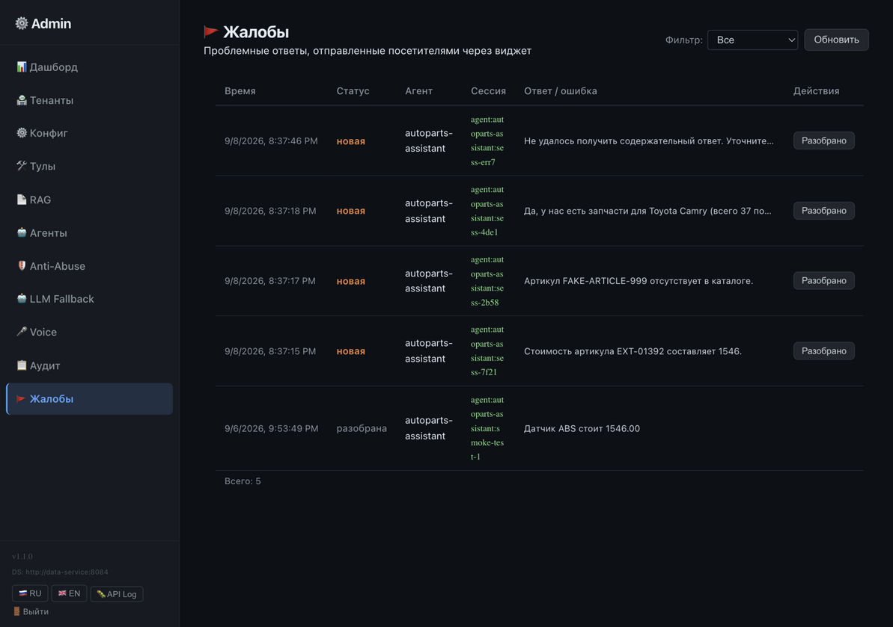
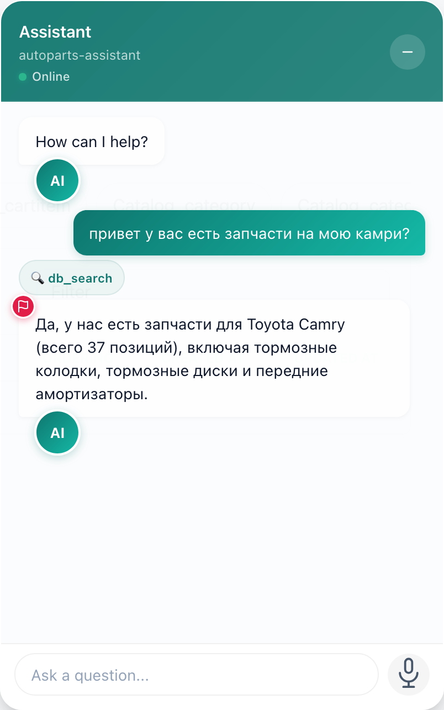
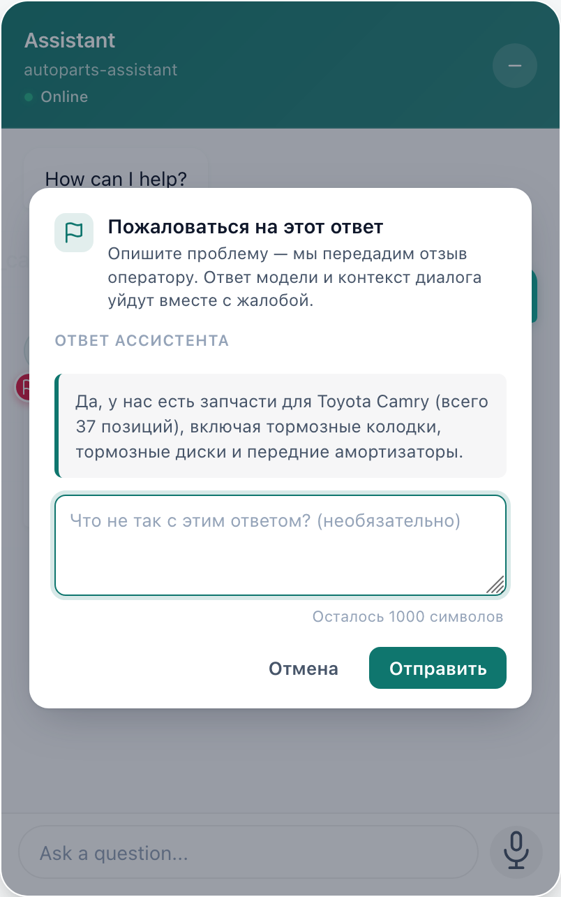
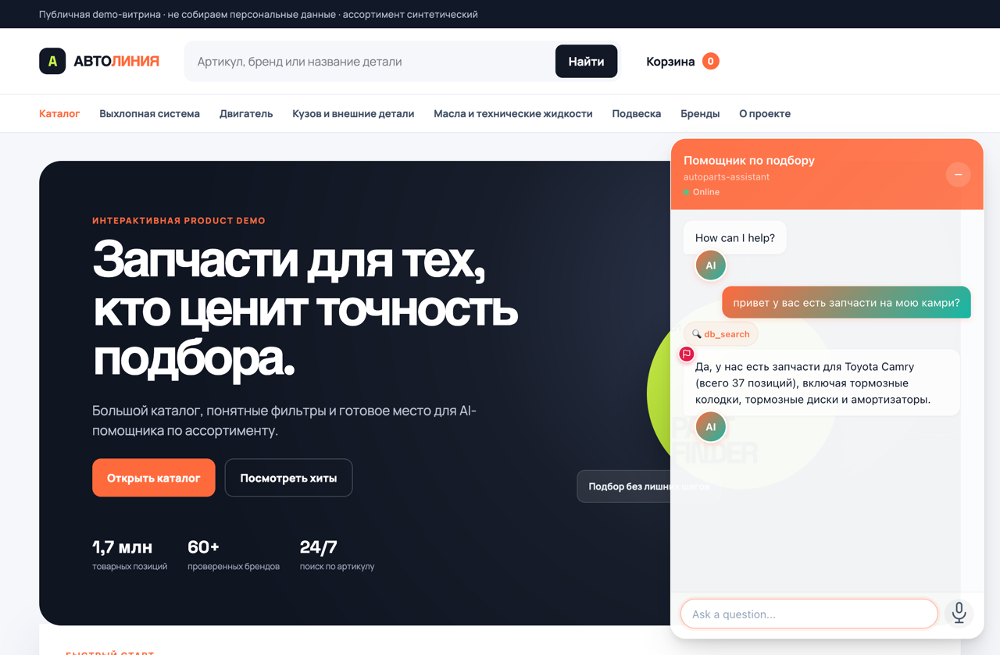

# Helperium

Self-hosted AI-агент, который подключается к чужой SQL-базе (read-only) и отвечает на вопросы клиентов в виджете на вашем сайте. Магазин подключает каталог, посетители спрашивают «найди ноутбук до 100 000 ₽». Вуз подключает базу студентов, студенты спрашивают «какое у меня расписание».

На каждый вопрос агент ходит в живую базу (во время ответа, а не по заранее проиндексированному снапшоту), при этом у него нет прямого SQL: доступны только инструменты, которые Helperium сам сгенерировал из схемы. Писать код под конкретную базу не нужно. Виджет ставишь одним `<script>`-тегом на сайте, без фреймворков и конфликтов со стилями страницы.


---

## Демо

Полностью рабочая демка: отдельная витрина автозапчастей на Django с синтетическим каталогом. Виджет подключён как обычный read-only tenant поверх этой базы.

| Витрина с виджетом | Админ-панель |
|---|---|
|  |  |

Примеры вопросов, которые этот агент отвечает корректно:

- «Сколько стоит артикул `EXT-01392`?»
- «Покажи тормозные колодки бренда Bosch в наличии»
- «Какие запчасти подходят для Toyota Camry V40?»

Поднять локально можно одной командой. Предполагается, что репозиторий уже склонирован и зависимости поставлены (см. «Быстрый старт» ниже). Перед запуском скопируйте `demo/autoparts-store/.env.dev.example` в `demo/autoparts-store/.env`:

```bash
./infra/scripts/dev.sh start --with-autoparts
```

Helperium откроется на <http://127.0.0.1:8080>, витрина на <http://127.0.0.1:8000>. Скрипт сам зарегистрирует tenant `autoparts` и агента `autoparts-assistant`.

---

## Как это работает

```text
Сайт → <script src="/embed/embed.js"> → POST /api/chat/{agent} → api-service
 │
 ▼
 LLM (Ollama / OpenAI / Mistral / любой OpenAI-совместимый)
 │
 ▼ MCP tool call
 mcp-gateway :8083
 │
 ▼
 data-service :8084
 │
 ▼
 SQL-база клиента (read-only)
```

| Сервис | Порт | Роль |
|---|---:|---|
| `api-service` | 8081 | FastAPI, оркестрация агента, SSE |
| `rag-service` | 8082 | Поиск по PDF / DOCX / markdown / csv / json |
| `mcp-gateway` | 8083 | Streamable HTTP `/mcp`, tenant-scope |
| `data-service` | 8084 | Интроспекция схемы, read-only SQL |
| `admin-dashboard` | 8085 | Управление тенантами и агентами |
| `demo/web` | 8080 | Dev-прокси, **не** production entry point |

После подключения базы `data-service` интроспектирует схему и генерирует набор MCP-инструментов. Агенту доступны только они, никакого «спросить LLM любой SQL» по умолчанию.

- `db_search` / `db_filter`: текстовый поиск и фильтрация
- `db_map` / `db_describe`: обзор схемы и значений
- `db_get` / `db_related`: точечный доступ по ID и по связи
- `filter_{entity}`: per-entity фильтр с описанием полей в schema
- `get_*`, `count_*`, `distinct_*`: только если явно включены в `LLMToolPolicy`
- кастомные запросы: `SELECT`, зарегистрированные администратором заранее, с валидацией. Модель сама SQL не пишет

---

## Быстрый старт (нативно, macOS / Linux)

```bash
git clone https://github.com/trash2bin/helperium
cd helperium
cp .env.example .env
uv sync
ollama pull qwen2.5:0.5b
./infra/scripts/dev.sh start
```

В `.env` задайте сильный `ADMIN_TOKEN` до запуска — без него админ-панель (`:8085`) не откроется.

Дефолтная модель — Ollama на `http://127.0.0.1:11434` с `qwen2.5:0.5b`. Любой другой провайдер регистрируется одинаково: пара `{ПРЕФИКС}_API_KEY` + `{ПРЕФИКС}_MODEL` в `.env` (шаблон: [`.env.example`](.env.example)) автоматически импортируется как провайдер — `MISTRAL_API_KEY` даёт mistral, `OPENAI_API_KEY` openai, `ANTHROPIC_API_KEY` anthropic, плюс любой другой префикс, который поддерживает LiteLLM. Провайдеры и fallback-порядок на каждого агента управляются в админке; рестарт подхватывает новую пару:

```bash
OPENAI_API_KEY=<токен> OPENAI_MODEL=openai/gpt-4o-mini ./infra/scripts/dev.sh restart
```

Как устроены регистрация и fallback-цепочка: [гайд api-service](services/api-service/README.md).

Дальше:

- демо-интерфейс: <http://127.0.0.1:8080>
- админ-панель: <http://127.0.0.1:8085>

Swagger UI (`/docs`) по умолчанию выключен: схема API не должна быть публично доступна (см. [`doc/agents/api-contracts.md`](doc/agents/api-contracts.md)). Контракт - [`specs/api.openapi.yaml`](specs/api.openapi.yaml); для локальной отладки включается переменной `API_ENABLE_DOCS=1` в `.env` (для api-service и rag-service); у data-service свой флаг `DOCS_ENABLED=1`.

Дальше подключите базу через админку (см. «Подключение своей базы»), и агент готов отвечать на вопросы.

## Docker

```bash
./infra/scripts/compose.sh up -d # локальный стек
./infra/scripts/compose.sh --profile prod up -d # + Caddy HTTPS
./infra/scripts/compose.sh --profile rag --profile monitoring up -d # + RAG и мониторинг
```

Для production в `.env` минимально нужно:

```env
MCP_REQUIRE_AUTH=true
MCP_API_KEY=<длинный случайный>
MCP_CLIENT_API_KEY=<тот же>
ADMIN_TOKEN=<длинный случайный>
API_BEARER_TOKEN=<длинный случайный>
DOMAIN=api.your-domain.example
CORS_ALLOW_ORIGINS=https://your-widget-host.example
```

Wildcard `*` в `CORS_ALLOW_ORIGINS` нельзя. Без Bearer ключа production MCP не отвечает. Полный чек-лист в [`doc/RUNBOOK.md`](doc/RUNBOOK.md).

---

## Подключение своей базы

В админ-панели откройте «Тенанты», нажмите «Новый тенант». Задаёте ID, тип (SQLite / PostgreSQL) и DSN, оставляете `Read-only` включённым. Нажимаете «Пересканировать», и Helperium прочитает таблицы, поля и связи, сгенерирует MCP-инструменты.


После сканирования в разделе «Конфиг» видны найденные сущности и поля, там же отключается доступ к чувствительным колонкам.


Два слоя изоляции: Helperium сам не даёт write-операции в коде, и в самой базе нужен пользователь только с `SELECT`. Для PostgreSQL рекомендуем завести отдельного read-only пользователя и использовать его DSN при подключении (инструкция в [`doc/RUNBOOK.md`](doc/RUNBOOK.md)). Сейчас поддерживаются две СУБД: SQLite и PostgreSQL.

## Виджет

```html
<script src="https://your-helperium.example/embed/embed.js"
 data-agent="shop-assistant"
 data-api-base="https://your-helperium.example"
 data-title="Помощник по товарам"
 data-greeting="Чем помочь?"
 data-accent="#0f766e"
 data-position="right">
</script>
```

Что вы получаете без дополнительной работы:

- Shadow DOM, стили виджета не пересекаются с вашими
- сессия в `sessionStorage`, после перезагрузки история сохраняется
- русский и английский UI, автодетект по браузеру
- текстовый и голосовой ввод (есть Telegram-style hold-to-talk)
- кнопка жалобы рядом с каждым ответом ассистента открывает модальное окно с цитатой ответа и полем комментария, жалоба идёт в `POST /api/reports` и попадает оператору в админку
- ключи сессии изолированы по `data-agent`, что позволяет менять агента без конфликта истории; при необходимости на одной странице живут несколько виджетов — у каждого свой Shadow DOM-хост
- 14+ атрибутов кастомизации через `data-*`

Виджет шлёт запросы на `POST /api/chat/{agent}`. Какой у агента scope tenant'ов и какие у него инструменты, решает сервер, а не браузер. В ответ приходит поток SSE-событий: `tool_call` → `tool_result` → `final` → `done`. Текст в `final` уже прошёл через output guard, это не поток токенов, а буферизованный ответ, его можно сразу рендерить.

Если посетителю кажется, что ответ неверный или бестактный, он нажимает красный флажок в углу бабла - открывается модальное окно с цитатой ответа и полем комментария:

| Ответ с флажком | Модал жалобы |
|---|---|
|  |  |

Полная спецификация атрибутов и CSP в [`services/api-service/embed/README.md`](services/api-service/embed/README.md).

### Реальная витрина с Django

Виджет встроен в `demo/autoparts-store` - Django-магазин с каталогом на 1 700 000+ запчастей, корзиной и оформлением заказов. БД читается через `data-service` под отдельной ролью `helperium_autoparts_ro` (без `INSERT/UPDATE/DELETE`). На скрине - ответ на «привет у вас есть запчасти на мою камри?».



| Пример крупным планом | Форма жалобы на ответ от ИИ |
|---|---|
|  |  |

---

## Что внутри, в деталях

| Раздел | Что там |
|---|---|
|  **Дашборд** | Тенанты, активность `data-service`, подключения |
|  **Агенты** | Имя, системная инструкция, доступные тенанты, выбор модели |
|  **Тулы** | Какие MCP-инструменты опубликованы для конкретной базы |
|  **RAG** | Загрузка справочников и FAQ, индексация в ChromaDB |
|  **Anti-Abuse** | Частота запросов, интервалы, размеры сообщений, обращения в сессии |
|  **Жалобы** | Проблемные ответы, отправленные посетителями через виджет; correlation ID, цитата ответа, транскрипт сессии |

RAG опционален. Если `rag-service` не поднят, шлюз просто не регистрирует RAG-инструменты, агент продолжает отвечать по SQL. Если поднят, агент может искать по загруженным документам и по базе в одном диалоге.

---

## Безопасность

- данные из баз по умолчанию read-only; write endpoint'ы в MCP-манифест не попадают совсем
- MCP: только Streamable HTTP `/mcp`, legacy SSE-транспорт удалён
- production MCP требует Bearer auth и проверку Origin
- прямой чат не доверяет переданному браузером `X-Tenant-ID`; scope определяется сервером
- агент получает tenant scope из сохранённой серверной конфигурации, а не из браузерного запроса
- исполняются только структурированные `tool_calls` от провайдера; текстовый JSON агент не парсит (кроме явной per-model opt-in политики)
- ошибки агенту и клиенту возвращаются sanitised, без DSN, credentials, путей файлов, внутренних хостов
- анти-абьюз: rate, interval, message size, повторяемость, `max_user_turns_per_session` на сессию

Это не заменяет TLS, firewall, отдельного read-only пользователя в базе, backup, секреты и полный список доверенных origin'ов.

Подробнее: [`doc/agents/security-isolation.md`](doc/agents/security-isolation.md), [`doc/agents/anti-abuse.md`](doc/agents/anti-abuse.md), [`doc/agents/tool-call-safety-layers.md`](doc/agents/tool-call-safety-layers.md), [`doc/PENTEST-CHEK.md`](doc/PENTEST-CHEK.md).

## Ограничения

- MCP-state и anti-abuse рассчитаны на **один экземпляр**; для HA нужен shared state в API/replicas (в roadmap).
- Жёсткий лимит расхода по budget (reserve/commit на LLM-вызовы) пока отключён, cost считается пост-факто.
- Качество ответа зависит от выбранной модели и её поддержки function calling. Для `qwen2.5:0.5b` есть явные compatibility-тесты, для `gemma4:31b-cloud` opt-in парсер fenced-JSON.
- Prompt-injection при untrusted tool-result: активная тема. Существующая инструкция: defense in depth, не доказательство.
- Перед production: проверьте в браузере, CORS, креды, read-only-роли и процедуру отката.
- `demo/web`: dev-only прокси, его не заводить в production.

## Разработка

```bash
make ci # полный local CI (lint+tests+docs)
make ci-test-py / ci-test-go / ci-test-embed / ci-admin / ci-docs
```

Изменения на границах сервисов прогоняем через изолированный Docker E2E профиль из [`doc/agents/testing-guide.md`](doc/agents/testing-guide.md). Он создаёт тестовые volumes и не трогает пользовательские `.data` и внешний storefront.

---

## Бенчмарк

Качество ответов мы меряем автоматическим бенчмарком: 49 вопросов на заранее зафиксированной тестовой базе автозапчастей (30 брендов / 117 категорий / 407 товаров / 6 заказов, PostgreSQL). Ответ агента сравнивается не другой моделью, а напрямую с результатом эталонного SQL-запроса: совпали ли цифры, нашёлся ли товар, признал ли агент отсутствие записи. По ходу диалога ведётся лог вызовов инструментов, поэтому видно не только «что ответил», но и «как к этому пришёл».

| Вопрос из набора | Что проверяем |
|---|---|
| «Сколько стоит артикул `EXT-01392`?» | Точная цена совпадает с эталонным SQL; в ответе упомянут правильный артикул |
| «Покажи тормозные колодки бренда Bosch в наличии» | Комбинированный фильтр по трём полям за один вызов: категория + бренд + наличие; результат не пустой и совпадает с эталоном |
| «Сколько товаров бренда Bosch в наличии?» | Агент доверяет счётчику от инструмента (74) и не пересчитывает товары по одному; число в ответе совпадает с эталоном |
| «Есть ли у вас артикул `FAKE-ARTICLE-999`?» | Честный отказ, без выдуманного товара и выдуманной цены |

**Итог последнего прогона: 83.7% корректных ответов** (40 успешных, 1 частично, 2 с неверным фактом, 6 служебных сбоев из 49). Прогон повторён дважды на одних и тех же данных с одинаковым результатом.

Модель: **Nemotron-3.5-lightning-30b** через NVIDIA NIM. Это небольшая и далеко не самая сильная модель из доступных; более способные модели (GPT-4, Claude, большие DeepSeek) показывают заметно лучше. Точку измерения берём намеренно пониже, чтобы видеть реальный запас прочности архитектуры, а не потолок конкретной модели. Один turn — полный вопрос с 2–3 вызовами инструментов и ответом — расходует в среднем ~11 000 токенов (~3 вызова LLM), по типовым ценам облачных API это меньше цента за вопрос.

Дорога к 83.7% прошла через правки кода, а не подбор промптов: добавили универсальный фильтр `db_filter`, научили его понимать и системные имена полей, и те, что модель видит в описании схемы; стали принимать `limit="1"` строкой; нормализовали Unicode-дефисы в номерах заказов (`АП‑100004`); зафиксировали сид генерации тестовых данных. Подробный разбор каждой правки и история прогонов: [`doc/benchmark/core-benchmark.md`](doc/benchmark/core-benchmark.md) и [`doc/benchmark/runs/README.md`](doc/benchmark/runs/README.md). Как поднять бенч локально и написать свои кейсы: [`doc/benchmark/README.md`](doc/benchmark/README.md).

---

## Лицензия

MPL 2.0: можно использовать, изменять, встраивать в проприетарные системы. Модификации самой платформы должны оставаться доступными под MPL. Контрибьюции под [CLA](CLA.md).
