# Helperium

Платформа для бизнеса, у которого есть база данных и нужен AI-помощник на сайте. Подключается база — агент сам разбирается в её структуре и отвечает на вопросы посетителей. Доступ к данным и таблицам настраивается в админ-панели.

Интернет-магазин подключает каталог товаров → посетители спрашивают «найди ноутбук до 100 000 ₽». Вуз подключает базу студентов → студенты спрашивают «какое у меня расписание на завтра?». Логистическая компания подключает складской учёт → операторы спрашивают «где заказ №4421?». Можно загрузить дополнительные документы (справочная информация, FAQ), чтобы агент мог выполнять поиск и по ним.

При локальной LLM и локальных embeddings данные не отправляются во внешние облачные сервисы. Если подключить внешний LLM- или embedding-провайдер, переданные ему данные обрабатываются по его настройкам и условиям.


## Что здесь есть

- ответы по актуальным данным из подключённой базы;
- поиск по FAQ, инструкциям, прайсам и другим документам;
- чат, который можно встроить на сайт одним `<script>`-тегом;
- настройки тенантов, агентов, моделей, инструментов и ограничений;
- локальное развёртывание, если данные и модель должны оставаться внутри вашей инфраструктуры.

Агент получает доступ только к данным и документам, разрешённым для него. Это не гарантирует безошибочный ответ: результат зависит от выбранной модели и её поддержки вызова инструментов.

## Как это работает

```text
Сайт → embed-виджет → api-service → LLM-агент
                                      │
                                      ▼
                         MCP Streamable HTTP /mcp
                                      │
                                      ▼
                         mcp-gateway → data-service
                                      │
                                      ▼
                         SQL-база клиента (read-only)

api-service → rag-service → ChromaDB
admin-dashboard → api-service, data-service, rag-service
```

| Сервис | Порт | Назначение |
|---|---:|---|
| `demo/web` | 8080 | Локальный интерфейс и прокси для разработки |
| `api-service` | 8081 | Чат, сессии, оркестрация агента и LLM |
| `rag-service` | 8082 | Поиск по документам и контекст для агента |
| `mcp-gateway` | 8083 | MCP-транспорт с изоляцией по тенанту и реестр инструментов |
| `data-service` | 8084 | Интроспекция схемы и read-only доступ к SQL-базам |
| `admin-dashboard` | 8085 | Управление тенантами, агентами, документами и политиками |

`demo/web` нужен для локальной разработки и демонстрации. Встраиваемый виджет обращается напрямую к `api-service`, минуя этот прокси.

## Данные и инструменты

После интроспекции схемы `data-service` создаёт конфигурацию тенанта и MCP-манифест. Агент получает ограниченный набор инструментов, а не произвольный SQL-интерфейс:

- `db_map` — карта сущностей, полей и связей;
- `db_describe` — описание сущности и её значений;
- `db_search` — текстовый поиск по разрешённым полям;
- `db_filter` — общий резервный инструмент для фильтрации;
- `db_get` — получение записи по идентификатору;
- `db_related` — переход по одной настроенной связи;
- `filter_{entity}` — фильтрация конкретной сущности с полями из схемы инструмента.

`get_*`, `count_*` и `distinct_*` публикуются только при отдельном включении в `LLMToolPolicy`. Пользовательские запросы задаются заранее, проходят валидацию и выполняются только как разрешённые `SELECT`.

Доступ к каждому тенанту ограничивается его конфигурацией и фильтрами строк. Инструменты не позволяют модели самостоятельно выбрать чужую базу или передать произвольный SQL.

## Что можно посмотреть

Для демо используется отдельная витрина автозапчастей с синтетическим каталогом. На её примере видно, что Helperium подключается к существующей товарной базе и помогает искать данные поверх обычного сайта.

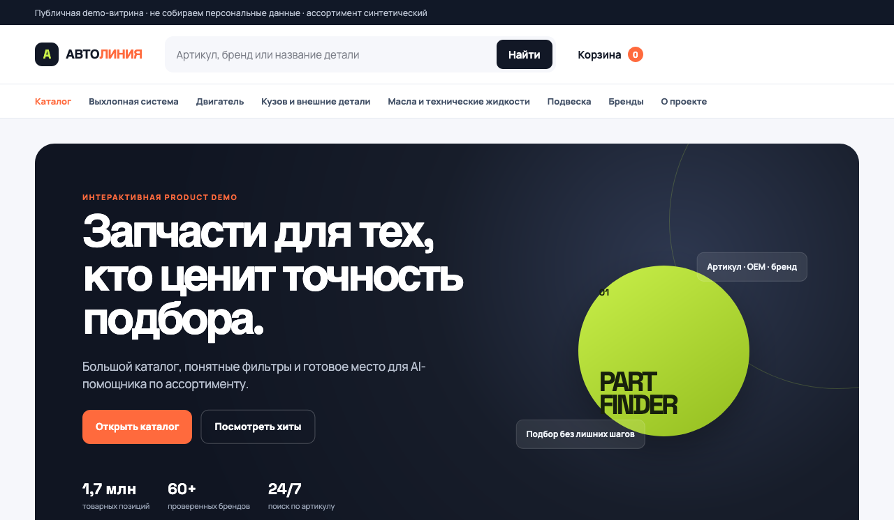

Главная страница демо-магазина с каталогом, категориями и точкой встраивания помощника.

| Витрина с открытым виджетом | Helperium Dashboard |
|---|---|
| 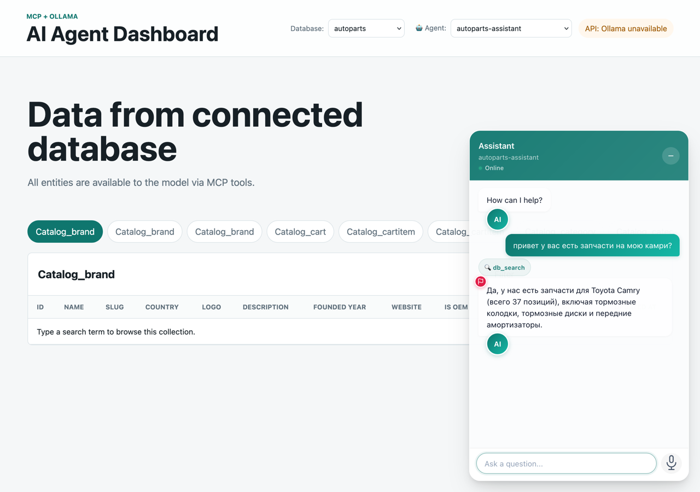 | 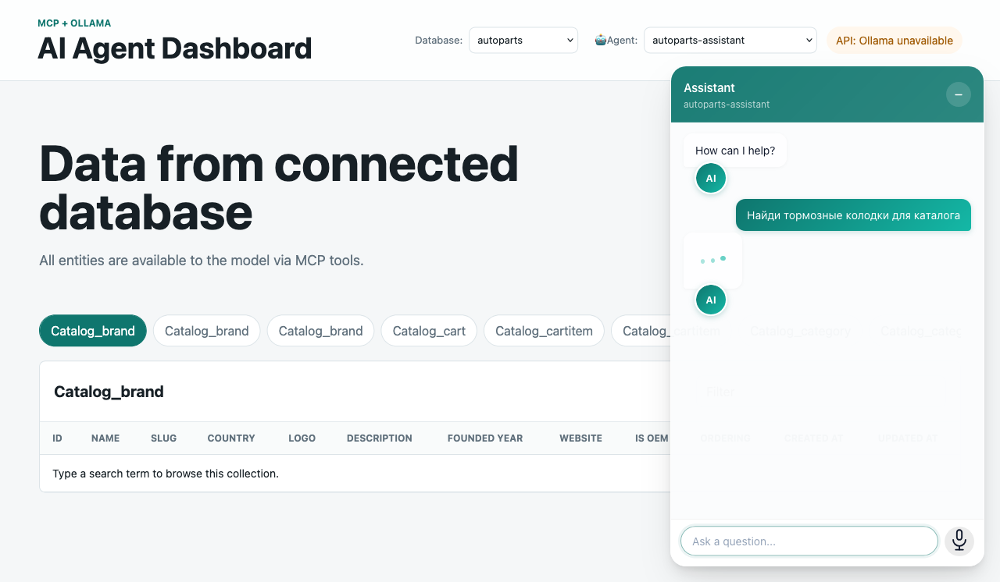 |

На витрине открыт виджет Helperium: в заголовке видны «Помощник по подбору» и агент `autoparts-assistant`, а в переписке — успешный финальный ответ. Сам storefront остаётся отдельным приложением, а виджет загружается через HTML5 `<script>` и обращается к API Helperium.

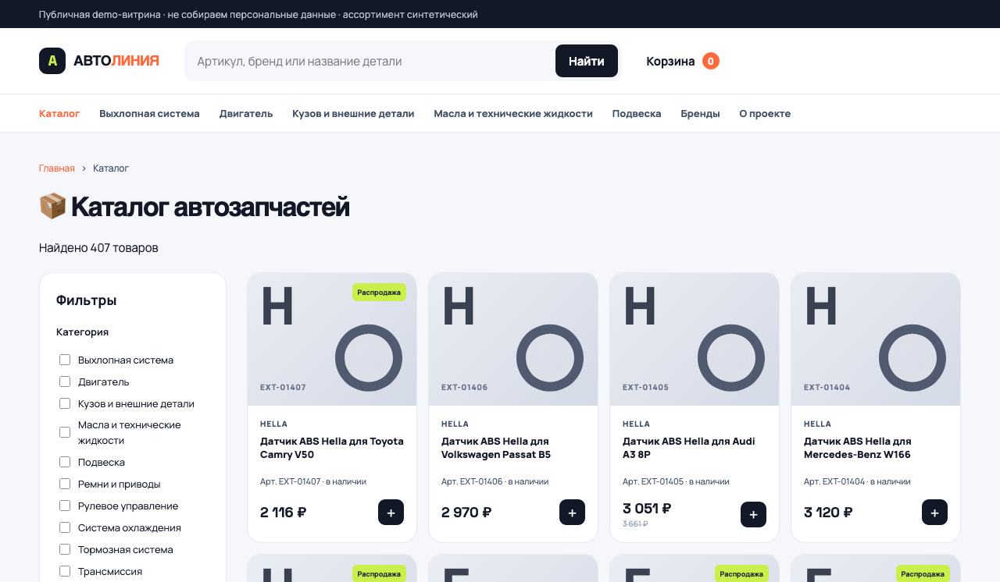

Каталог с фильтрами, карточками товаров, брендами и ценами — данные для ассистента берутся из этой подключённой базы.

Витрина остаётся отдельным приложением: Helperium подключается к её PostgreSQL как read-only tenant и не становится частью storefront.

## Быстрый старт

Нативный запуск подходит для macOS и Linux. Нужны Git, Python 3.13, `uv` и доступная LLM-модель. Для локального варианта установите Ollama и модель из `.env.example`.

```bash
git clone https://github.com/trash2bin/helperium
cd helperium
cp .env.example .env
uv sync
ollama pull qwen2.5:0.5b
./infra/scripts/dev.sh start
```

После запуска:

- интерфейс: <http://127.0.0.1:8080>;
- админ-панель: <http://127.0.0.1:8085>;
- API Swagger: <http://127.0.0.1:8081/docs>.

Для другого локального или внешнего провайдера измените `.env` или настройте его через админ-панель. Команда `start` поднимает сервисы, но не создаёт тенанта и агента: их нужно зарегистрировать отдельно.

```bash
./infra/scripts/dev.sh stop
```

## Docker и production

Для локального запуска основных сервисов:

```bash
./infra/scripts/compose.sh up -d
```

Для HTTPS через Caddy:

```bash
./infra/scripts/compose.sh --profile prod up -d
```

Для RAG, Prometheus и Grafana:

```bash
./infra/scripts/compose.sh --profile rag --profile monitoring up -d
# или вместе с production-профилями:
./infra/scripts/compose.sh --profile prod --profile rag --profile monitoring up -d
```

Для production задайте `MCP_REQUIRE_AUTH=true`, одинаковые сильные значения `MCP_API_KEY` и `MCP_CLIENT_API_KEY`, `ADMIN_TOKEN`, `API_BEARER_TOKEN`, `DOMAIN` и точный список доверенных источников в `CORS_ALLOW_ORIGINS`. Не оставляйте MCP без аутентификации и не используйте wildcard CORS. Порядок настройки — [`doc/RUNBOOK.md`](doc/RUNBOOK.md).

## Подключение базы

Подключение базы выполняется через админ-панель:

1. Откройте раздел «Тенанты» и нажмите «Новый тенант».
2. Укажите идентификатор, тип базы и DSN, затем оставьте режим `Read-only` включённым.
3. Откройте конфигурацию созданного тенанта и нажмите «Пересканировать», чтобы Helperium прочитал таблицы, поля и связи.

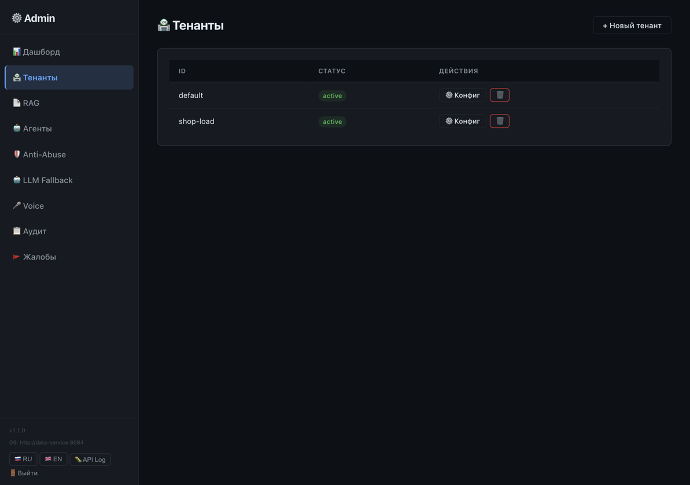

После сканирования конфигурацию можно проверить в разделе «Конфиг»: там видны найденные сущности и поля, а доступ к ним включается отдельно.

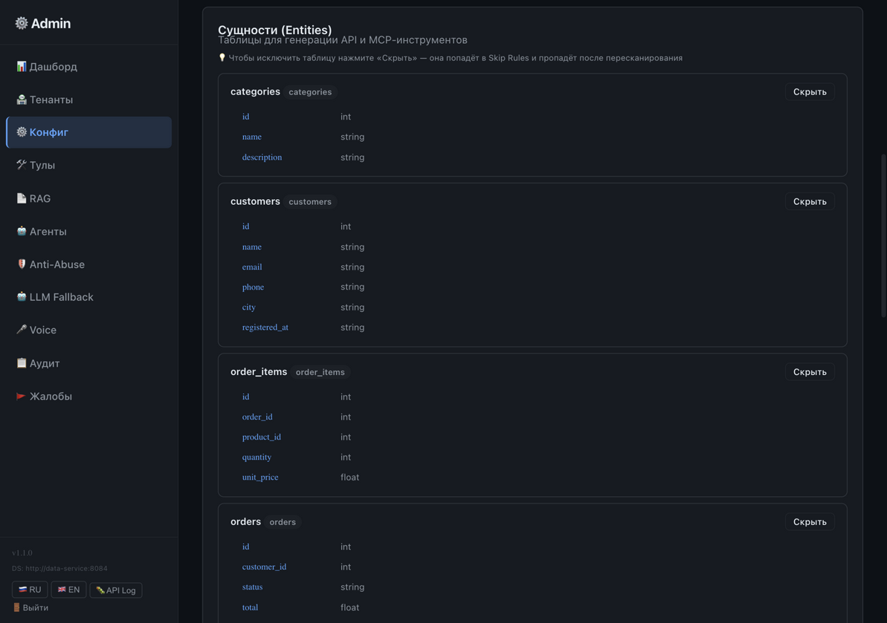

### Пошаговый пример для SQLite

Ниже — тот же сценарий целиком на небольшой учебной SQLite-базе.

1. В разделе «Тенанты» нажмите «Новый тенант», задайте понятный ID и выберите режим «SQLite — загрузить файл».

   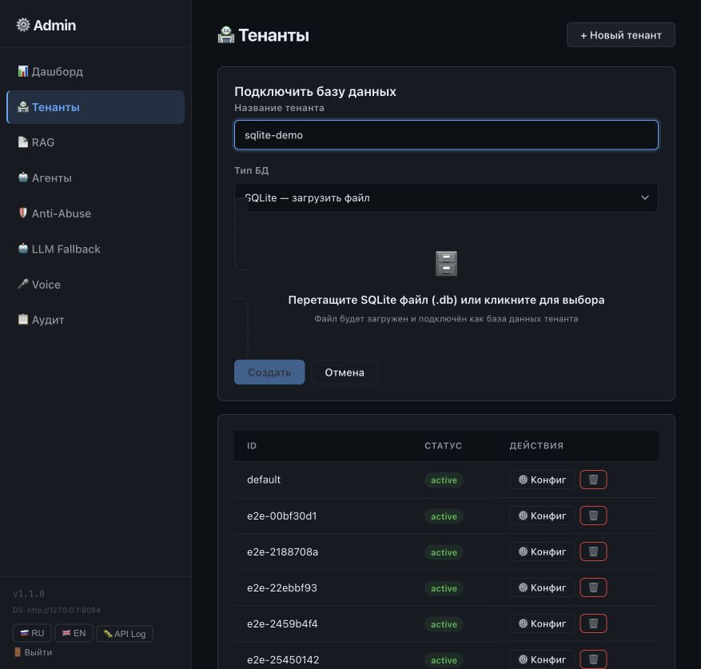

2. Перетащите файл `.db` в форму и нажмите «Создать». Helperium сохранит копию базы в своём data-каталоге и зарегистрирует новый тенант в read-only режиме. После создания он появится среди активных тенантов.

   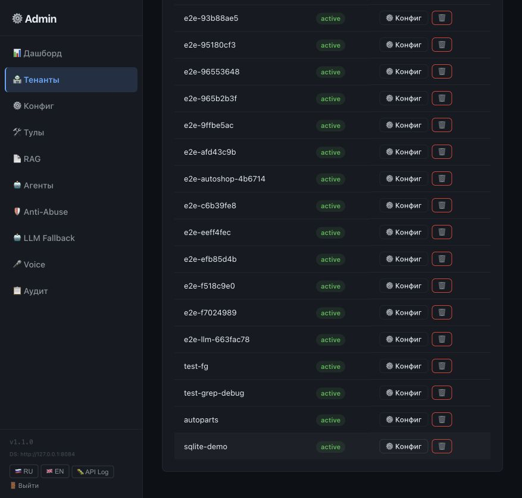

3. Откройте конфигурацию нового тенанта и нажмите «Пересканировать». Сервис прочитает схему SQLite и сгенерирует разрешённые сущности и инструменты без изменения исходного файла.

   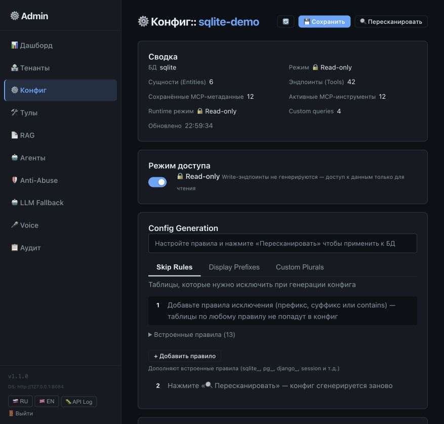

4. Проверьте результат: в конфиге отображаются найденные таблицы, поля, количество MCP-инструментов и включённый `Read-only`.

   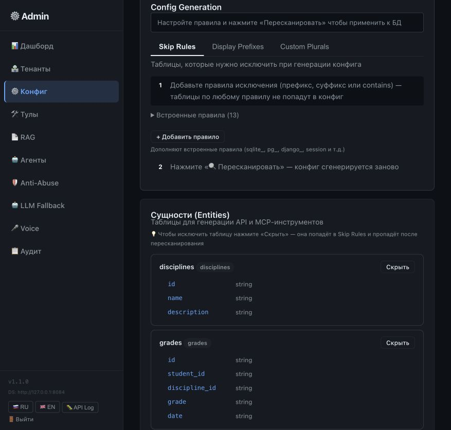

Для каждого тенанта используйте отдельные credentials. Параметр `read_only: true` запрещает записывающие endpoint'ы на уровне приложения. Для database-level защиты используйте пользователя только с правами `SELECT` и, для PostgreSQL, отдельный `readonly_dsn`. При изоляции по заголовку фильтры строк должны быть настроены для каждой сущности.

### Что ещё можно настроить в админке

После подключения базы основные настройки доступны из бокового меню. На дашборде видно, сколько тенантов зарегистрировано, отвечает ли `data-service` и какие подключения активны.

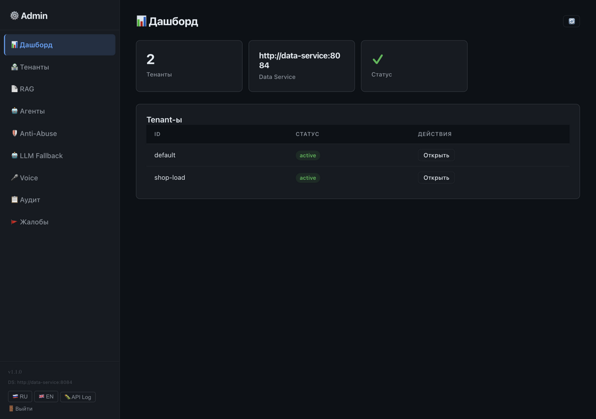

В разделе «Агенты» создаётся профиль помощника: ему задают имя, системную инструкцию, доступные тенанты и порядок выбора LLM-моделей.

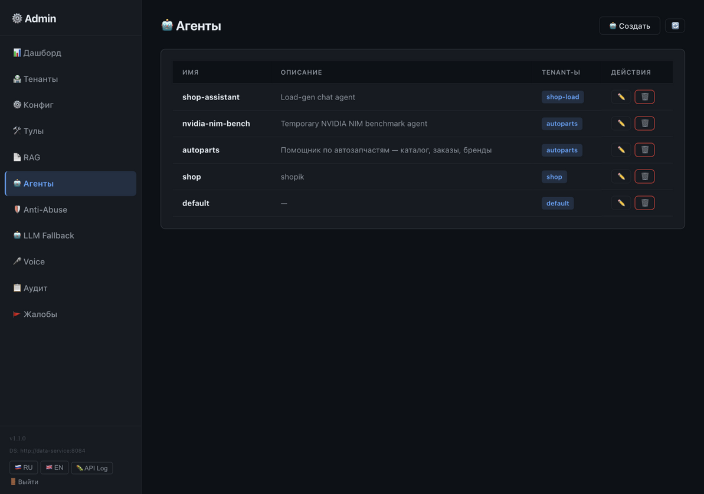

Раздел «Тулы» показывает инструменты, которые агент может вызывать для конкретной базы. Ненужные операции можно отключить, а read-only режим остаётся отдельным ограничением.

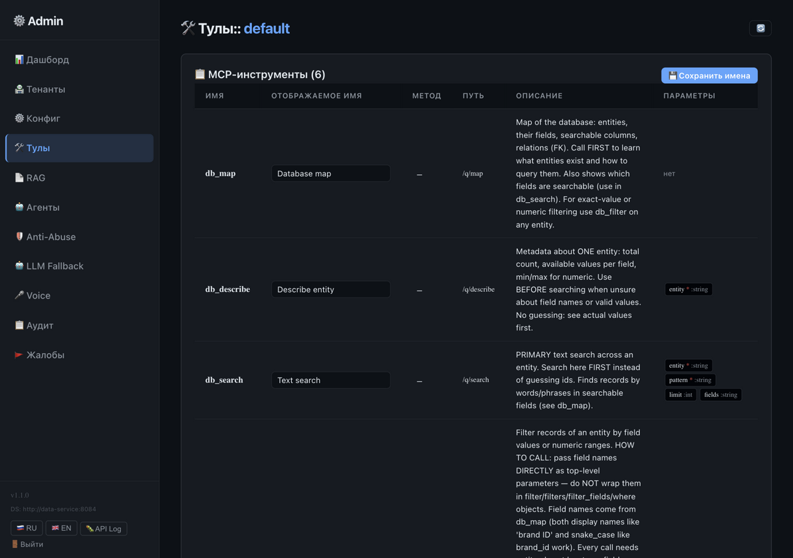

В «RAG» загружаются справочники, инструкции, прайсы и FAQ. После индексации агент сможет искать по документам вместе с живыми данными SQL-базы.

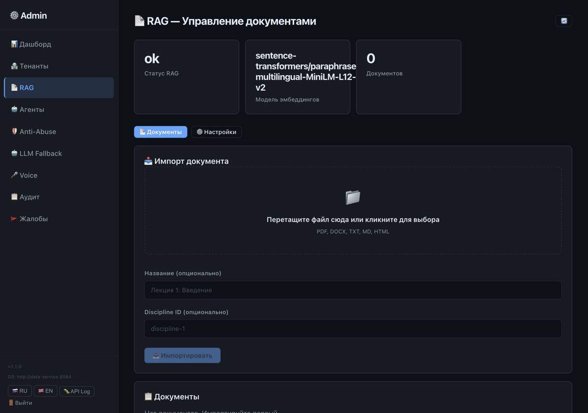

В «Anti-Abuse» задаются ограничения для публичного чата: частота запросов, интервалы, размеры сообщений и число обращений в сессии.

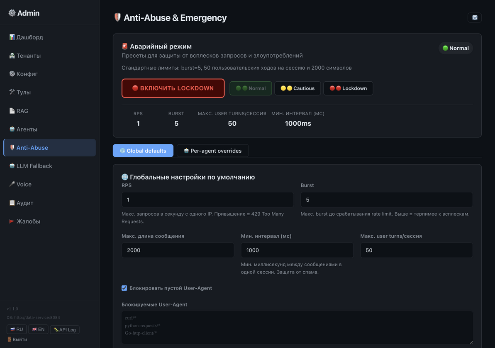


## Виджет

```html
<script src="https://your-helperium.example/embed/embed.js"
        data-agent="shop-assistant"
        data-api-base="https://your-helperium.example"
        data-title="Помощник по товарам"
        data-greeting="Чем помочь?"
        data-accent="#0f766e"
        data-position="right">
</script>
```

Виджет не имеет зависимостей во время работы, изолирует стили через Shadow DOM, хранит текущую сессию в `sessionStorage`, поддерживает русский и английский интерфейс, текстовый и голосовой ввод и несколько независимых агентов на одной странице.

Запросы идут на `POST /api/chat/{agent}`. Идентификаторы тенантов, credentials и список инструментов определяются на сервере из Agent Store и конфигурации тенанта.

Ответы доставляются через SSE. `final` содержит финальный текст после проверки output guard; это буферизованная доставка, а не потоковая передача токенов. Во время работы могут приходить `tool_call` и `tool_result`, после чего поток завершается `done` или `error`.

Полная справка по атрибутам и CSP — [`services/api-service/embed/README.md`](services/api-service/embed/README.md).

### Примеры запросов к автозапчастям

В демо-магазине можно задавать обычные вопросы, без названий таблиц и SQL:

| Запрос в виджет | Что делает агент |
|---|---|
| «Сколько стоит артикул `EXT-01392`?» | Находит товар по артикулу и возвращает цену из каталога. |
| «Есть ли в наличии артикул `EXT-01367`?» | Проверяет наличие и остаток товара. |
| «Покажи тормозные колодки бренда Bosch в наличии» | Фильтрует каталог одновременно по категории, бренду и наличию. |
| «Сколько товаров бренда Bosch в наличии?» | Выполняет агрегирующий запрос и возвращает количество позиций. |
| «Какие запчасти подходят для Toyota Camry V40?» | Ищет подходящие товары, затем запрашивает детали найденных позиций. |


### Что происходит под капотом

```text
1. Посетитель пишет вопрос в виджете
2. api-service принимает сообщение и выбирает агента
3. Агент выбирает разрешённый MCP-инструмент
4. mcp-gateway проверяет tenant scope и вызывает data-service
5. data-service выполняет только разрешённый read-only запрос
6. Результат возвращается агенту, затем финальный текст — в виджет
```

На уровне событий это выглядит так:

```text
tool_call  →  db_search / db_filter / db_get
tool_result →  найденные товары, цены и остатки
final      →  понятный ответ посетителю
done       →  завершение SSE-сессии
```

В админке список доступных операций можно проверить отдельно. Для автозапчастей агент видит только опубликованные инструменты своего тенанта; произвольный SQL и чужие базы ему не выдаются.

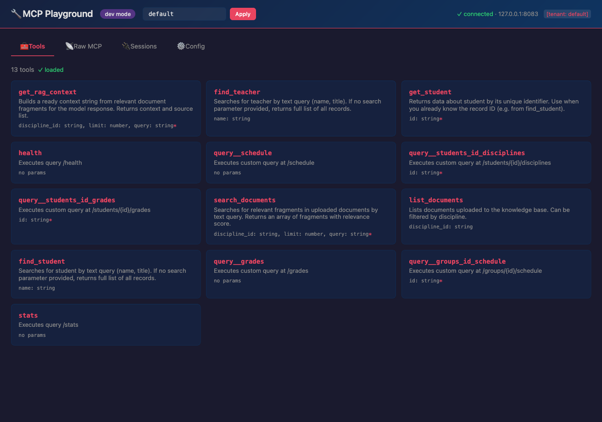


## Документы и RAG

`rag-service` индексирует PDF, DOCX, TXT и Markdown, разбивает документы на фрагменты, строит векторные представления и хранит индекс в ChromaDB. Доступны локальная модель Sentence Transformers и OpenAI-совместимые embedding API.

RAG не требуется для работы с живой SQL-базой. При запуске шлюз проверяет доступность RAG; если сервис недоступен, RAG-инструменты не регистрируются. SQL-инструменты data-service при этом остаются отдельной частью MCP-поверхности.

## Безопасность

- доступ к данным read-only по умолчанию;
- write endpoints не генерируются автоматически и не публикуются агенту в стандартной конфигурации;
- MCP использует только Streamable HTTP `/mcp`, устаревший SSE-транспорт удалён;
- production MCP требует Bearer-аутентификацию и проверку источника браузерного запроса;
- прямой чат не доверяет переданному браузером `X-Tenant-ID`;
- именованный агент получает область тенанта из сохранённой серверной конфигурации;
- исполняются только структурированные вызовы инструментов, возвращённые провайдером в специальном поле;
- ошибки очищаются перед отправкой пользователю и не должны раскрывать DSN, credentials, пути файлов или внутренние адреса;
- защита от злоупотреблений ограничивает частоту, размер и повторяемость сообщений, интервал и число принятых обращений.

Это не заменяет настройку TLS, firewall, прав пользователя базы, резервного копирования, секретов и списка разрешённых origin'ов.

Подробнее: [`doc/agents/security-isolation.md`](doc/agents/security-isolation.md), [`doc/agents/anti-abuse.md`](doc/agents/anti-abuse.md), [`doc/PENTEST-CHEK.md`](doc/PENTEST-CHEK.md).

## Ограничения текущей версии

- MCP-сессии с состоянием и часть защиты от злоупотреблений рассчитаны на один экземпляр сервиса;
- жёсткий лимит расходов через reserve/commit пока отключён, текущая стоимость провайдера учитывается после выполнения запроса;
- качество зависит от модели, поддержки вызова инструментов и настроек агента;
- системная инструкция о недоверенных результатах инструментов является дополнительной защитой, но не доказательством полной защиты от prompt injection;
- production требует отдельной проверки в браузере, CORS, credentials, read-only-роли и процедуры отката;
- `demo/web` не является production-точкой входа.

## Проверка и разработка

```bash
make ci
make ci-test-py
make ci-test-go
make ci-test-embed
make ci-admin
make ci-docs
```

Для изменений на границах сервисов используйте изолированный Docker E2E-профиль из [`doc/agents/testing-guide.md`](doc/agents/testing-guide.md). Он создаёт собственные тестовые volumes и не должен писать в пользовательские данные или внешний demo-store.

## Автономный demo-магазин автозапчастей

`demo/autoparts-store` — отдельное Django-приложение с синтетическим каталогом. Оно не входит в production runtime Helperium и не запускается обычной командой `dev.sh start`.

```bash
cp demo/autoparts-store/.env.dev.example demo/autoparts-store/.env
# Задайте локальные пароли базы данных
./infra/scripts/dev.sh start --with-autoparts
```

Helperium доступен на <http://127.0.0.1:8080>, storefront — на <http://127.0.0.1:8000>. Флаг запускает отдельный Compose-стек и автоматически регистрирует или обновляет tenant `autoparts`, выполняет rewrite конфигурации и подготавливает агента `autoparts-assistant`. Перед публикацией всё равно проверьте именованного агента и настройки виджета. Storefront не становится частью ядра Helperium. Инструкция — [`demo/autoparts-store/README.md`](demo/autoparts-store/README.md).

## Лицензия

Helperium распространяется под [Mozilla Public License 2.0](LICENSE). Вы можете использовать и изменять платформу, в том числе внутри проприетарной системы. Условия MPL применяются к распространению изменённых файлов платформы.

Проект также использует [Contributor License Agreement](CLA.md).
