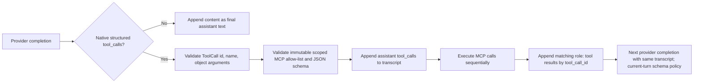

# Native Tool-Call Contract

## Purpose

The agent executes MCP tools only when the selected LLM provider returns a **native structured tool call**. A model response is never executed because ordinary assistant text merely resembles JSON, XML, Markdown, a code block, or a provider-specific delimiter.

This is both a correctness and a security boundary. It eliminates heuristic text parsing, avoids false positives on domain JSON, and makes every executable action traceable through one typed provider response.

## Execution model



`AppendOnlyLoop` is the sole owner of this flow. Its `Transcript.messages` list is append-only and is the exact list passed to the provider on every model call.

## Provider boundary

`api_service.agent.models` defines the typed boundary:

| Type | Contract |
|---|---|
| `CompletionRequest` | Full linear transcript and complete scoped MCP tool schemas; adapter may suppress only immediate current-turn continuation schemas on the provider wire |
| `CompletionResponse` | Final text or a list of native structured tool calls, plus optional usage/cost |
| `ToolCall` | Pydantic `id`, `name`, and object-shaped `arguments` |
| `LLMProvider` | `complete(CompletionRequest) -> CompletionResponse` |

`LiteLLMProvider` translates LiteLLM response fields into this shape. It rejects malformed native calls: missing IDs or names, invalid JSON argument strings, and non-object arguments are provider errors. It does not enable `add_function_to_prompt`. The only content inspection it may perform is the opt-in policy-gated text-envelope fallback described below.

`ScriptedLLMProvider` implements the exact same contract for deterministic unit and E2E tests. Its JSONL fixtures model provider responses, not parser input formats.

## Extraction and normalisation pipeline (stages, priority)

One completion passes four layers in a fixed order. Each layer only sees what the earlier layers produced. Executable calls always originate in stage 1 or 2; stages 3–4 never invent tool calls — they only classify or normalise plain content.

| # | Layer | Where | What it does |
|---|---|---|---|
| 1 | Native extraction | LiteLLM inside `LiteLLMProvider.complete` | LiteLLM normalises every provider/subprovider wire format into `message.tool_calls`. This is always tried first and is the only source of executable calls by default. |
| 2 | Policy text-envelope parser | `LiteLLMProvider._text_tool_call` | Fallback, only when stage 1 returned **zero** calls **and** the verified `ProviderModelPolicy` for this provider/model sets `parse_text_tool_calls=True`. Parses the whole content as one exact `{"name", "arguments"}` JSON object (optionally fenced) whose name is advertised in the request's tool schemas; synthetic ids are `text-call-*`. This is a LiteLLM-adapter concern (models whose calls arrive as text on the LiteLLM wire); a custom transport owns its own equivalent. |
| 3 | Response-shape middleware | `AnswerNormalizer` (`agent/answer_normalizer.py`), wrapped around real transports in `factory.resolve_llm` | Provider-agnostic content hygiene: content that is *entirely* a fabricated tool-call envelope (`Tool Calls: [...]`, wire-format array, fenced) is rewritten to empty content (stage 4 then counts an empty round); a single-key `{"answer"/"text"/"response"/"message": "<str>"}` envelope is unwrapped to the inner string. Everything else — native calls, data-shaped JSON (product lists, user-requested JSON), plain text — passes through untouched. |
| 4 | Conversation semantics | `AppendOnlyLoop` | Echo of the last tool result verbatim → empty round (regenerate, no steering text); empty-round limit → standard fallback text; input/output guards; model/tool/context limits. |

Invariants: stages 3–4 never execute anything; data-shaped JSON is a legitimate final answer and is never rewritten; no layer injects model-facing steering text. Whether a model may use tools at all is still decided solely by stages 1–2.

## What is intentionally unsupported (default contract)

Without a verified per-model policy the following content is **final assistant text**, not an executable tool invocation:

```text
<invoke name="search"><query>Bosch</query></invoke>
```json
{"tool_calls":[...]}
```
```

Two narrow exceptions are intentional:

- A verified `ProviderModelPolicy` may opt into stage 2: the *entire* response is one exact `{"name", "arguments"}` JSON object (optionally fenced) whose name is advertised — it becomes a real tool call.
- Stage 3 never executes anything: fabricated `Tool Calls: [...]` markup becomes an empty round, and a single-key answer envelope is unwrapped to text. Data-shaped JSON (e.g. a product list the user asked for) is always preserved verbatim.

A provider that emits other text encodings may still answer normal chat requests, but it cannot use MCP tools until its LiteLLM integration returns native structured `tool_calls` (or the strict stage-2 policy is enabled for it). This is an intentional trade-off: portability through general text parsing is not worth ambiguous execution or a second compatibility runtime.

## Transcript and result matching

Before dispatch, the loop appends one assistant message containing every native requested call. For each call it appends one `role: tool` result whose `tool_call_id` is the original `ToolCall.id`. Multiple calls execute sequentially, preserving the scoped MCP session order and an unambiguous provider transcript:

```text
user
assistant(tool_calls: call-a, call-b)
tool(tool_call_id: call-a)
tool(tool_call_id: call-b)
assistant(final text)
```

The next provider request receives this exact sequence. A fresh later user turn also replays it as history, but historical `role: tool` messages never suppress its scoped schemas. Only the immediate completion after the current turn's unresolved tool result may apply the LiteLLM capability decision on the provider wire. No `TurnContext`, middleware event mutation, parser result cache, fallback prompt, or second transcript exists.

## Validation and terminals

The loop builds an immutable allow-list from `mcp_session.list_tools()` before the first provider call. Every requested name and argument object is checked against the scoped MCP JSON schema before `call_tool()` can run.

| Condition | Terminal behavior |
|---|---|
| Input guard blocks user text | Sanitised `error`; no tool discovery or provider call |
| Unknown tool or invalid arguments | Sanitised `error`; no MCP call and no recovery completion |
| MCP tool error | Tool result event followed by one terminal error; no hidden retry completion |
| Dependency-style tool error | Retryable sanitised dependency error |
| Provider error | Retryable sanitised provider error |
| Cancellation | One cancellation error; no recovery completion |
| Model/tool/context/empty-response limit | One explicit terminal error |
| Final provider text | Output guard, then `final` |
| Final text copies the last tool result verbatim | Not published. Counted as an empty round; regenerate from the same transcript without steering text; at the limit, degraded to the standard fallback text |

The chat route emits its existing terminal `done` frame after the event stream ends.

## Debugging: a model's answer reaches the user in the wrong shape

Symptom: the widget bubble shows raw JSON, a `Tool Calls: [...]` list, tool data, or another envelope instead of a natural-language answer.

1. **Find the turn.** Take `correlation_id` from the response/log and trace it in `api.log`:
   ```bash
   grep -a '<correlation_id>' .data/logs/api.log
   grep -a 'event_type=final' .data/logs/api.log | tail
   ```
   `[SERVER] event_type=final` shows the exact bytes the user received — this is the ground truth of what leaked.
2. **Identify the model.** `[LLM] completion policy model=... provider=...` lines in the same correlation tell you which adapter and policy served the turn (e.g. `gemma4:31b-cloud` is known to emit both fabricated tool-call envelopes and `{"answer": ...}` wrappers).
3. **Decide which stage should have caught it.** Compare the leaked bytes against the pipeline above:
   - whole-body tool-call markup → stage 3 `is_tool_call_markup` (log line: `fabricated tool-call envelope; replacing with an empty round`);
   - single-key answer wrapper → stage 3 `unwrap_answer_envelope` (log line: `unwrapped single-key answer envelope`);
   - verbatim copy of the last tool result → stage 4 `_echoes_last_tool_result` (loop);
   - none of those → a new shape; this is where you look in code.
4. **Fix at the right layer.** Conversation semantics (echoes, empty rounds, limits) belong to `loop.py`. Pure content-shape quirks belong to `answer_normalizer.py` and must stay provider-agnostic. Wire-level/policy-gated extraction belongs to the adapter (`litellm_provider.py`). Never fix by adding steering text to the transcript.
5. **Red-first regression.** Reproduce with `ScriptedLLMProvider` in `tests/unit/agent/test_answer_normalizer.py` (shape predicates) or `test_loop.py` (full loop behaviour): craft a `CompletionResponse(content=...)` with the exact leaked bytes, assert the user-visible outcome, watch it fail, then fix. Live-verify only after the unit is green — the incidents of 2026-09-06 were both intermittent and only reproducible deterministically at unit level.
6. **Guard the boundary.** Any new predicate must keep data-shaped JSON passing through (see `test_json_product_list_remains_a_legitimate_final_answer`) — blocking legitimate JSON answers is a worse failure than the quirk itself.

## Regression contracts

The current focused contracts are intentionally behavioral rather than parser-implementation tests:

| Test | Guarantees |
|---|---|
| `test_loop.py` | Tool results enter the next provider request; IDs and order survive multiple calls; text is never parsed as a tool; invalid tools, failures, limits, and cancellation stop explicitly; fabricated tool-call markup and JSON answer envelopes never reach the user as the final answer |
| `test_answer_normalizer.py` | Stage-3 predicates: fabricated envelope → empty round, single-key answer envelope → unwrapped, data-shaped JSON and plain text pass through verbatim |
| `test_orchestrator.py` | Public SSE order, server-resolved tenant scope, and persisted `user → assistant → tool → assistant` transcript |
| `test_litellm_provider.py` | Native call normalization, malformed-native-call rejection, text finality, policy-gated text-envelope parsing, current-turn continuation policy, historical-tool cross-turn schemas, and cost propagation |

**Last verified:** 2026-09-06 (working tree after `93fa78d` + uncommitted fixes) — native structured tool calls remain the primary executable protocol; the only text-parsing exception is the verified per-model stage-2 policy; fabricated tool-call markup and single-key answer envelopes are contained by the provider-boundary middleware (`AnswerNormalizer`); verbatim tool-result echoes are never published; model-facing behavior stays structural (schemas, allow-list, validation, limits, regeneration), never steering text. Focused suites `test_loop.py`, `test_answer_normalizer.py`, `test_litellm_provider.py`, `test_provider_compatibility.py` green; full api suite 563 passed; isolated Docker E2E 148 passed.
