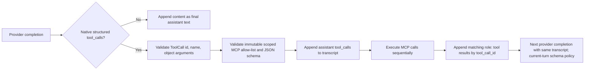

# Native Tool-Call Contract

## Purpose

The agent executes MCP tools only when the selected LLM provider returns a **native structured tool call**. A model response is never executed because ordinary assistant text merely resembles JSON, XML, Markdown, a code block, or a provider-specific delimiter.

This is both a correctness and a security boundary. It eliminates heuristic text parsing, avoids false positives on domain JSON, and makes every executable action traceable through one typed provider response.

## Execution model



`AppendOnlyLoop` is the sole owner of this flow. Its `Transcript.messages` list is append-only and is the exact list passed to the provider on every model call.

## Provider boundary

`api_service.agent.models` defines the typed boundary:

| Type | Contract |
|---|---|
| `CompletionRequest` | Full linear transcript and complete scoped MCP tool schemas; adapter may suppress only immediate current-turn continuation schemas on the provider wire |
| `CompletionResponse` | Final text or a list of native structured tool calls, plus optional usage/cost |
| `ToolCall` | Pydantic `id`, `name`, and object-shaped `arguments` |
| `LLMProvider` | `complete(CompletionRequest) -> CompletionResponse` |

`LiteLLMProvider` translates LiteLLM response fields into this shape. It rejects malformed native calls: missing IDs or names, invalid JSON argument strings, and non-object arguments are provider errors. It does not enable `add_function_to_prompt` and does not scan `content` for actions.

`ScriptedLLMProvider` implements the exact same contract for deterministic unit and E2E tests. Its JSONL fixtures model provider responses, not parser input formats.

## What is intentionally unsupported

The following content is **final assistant text**, not an executable tool invocation:

```text
{"name":"search","arguments":{"query":"Bosch"}}
<invoke name="search"><query>Bosch</query></invoke>
```json
{"tool_calls":[...]}
```
```

A provider that emits these encodings may still answer normal chat requests, but it cannot use MCP tools until its LiteLLM integration returns native structured `tool_calls`. This is an intentional trade-off: portability through text parsing is not worth ambiguous execution or a second compatibility runtime.

## Transcript and result matching

Before dispatch, the loop appends one assistant message containing every native requested call. For each call it appends one `role: tool` result whose `tool_call_id` is the original `ToolCall.id`. Multiple calls execute sequentially, preserving the scoped MCP session order and an unambiguous provider transcript:

```text
user
assistant(tool_calls: call-a, call-b)
tool(tool_call_id: call-a)
tool(tool_call_id: call-b)
assistant(final text)
```

The next provider request receives this exact sequence. A fresh later user turn also replays it as history, but historical `role: tool` messages never suppress its scoped schemas. Only the immediate completion after the current turn's unresolved tool result may apply the LiteLLM capability decision on the provider wire. No `TurnContext`, middleware event mutation, parser result cache, fallback prompt, or second transcript exists.

## Validation and terminals

The loop builds an immutable allow-list from `mcp_session.list_tools()` before the first provider call. Every requested name and argument object is checked against the scoped MCP JSON schema before `call_tool()` can run.

| Condition | Terminal behavior |
|---|---|
| Input guard blocks user text | Sanitised `error`; no tool discovery or provider call |
| Unknown tool or invalid arguments | Sanitised `error`; no MCP call and no recovery completion |
| MCP tool error | Tool result event followed by one terminal error; no hidden retry completion |
| Dependency-style tool error | Retryable sanitised dependency error |
| Provider error | Retryable sanitised provider error |
| Cancellation | One cancellation error; no recovery completion |
| Model/tool/context/empty-response limit | One explicit terminal error |
| Final provider text | Output guard, then `final` |
| Final text copies the last tool result verbatim | Not published. Counted as an empty round; regenerate from the same transcript without steering text; at the limit, degraded to the standard fallback text |

The chat route emits its existing terminal `done` frame after the event stream ends.

## Regression contracts

The current focused contracts are intentionally behavioral rather than parser-implementation tests:

| Test | Guarantees |
|---|---|
| `test_loop.py` | Tool results enter the next provider request; IDs and order survive multiple calls; text is never parsed as a tool; invalid tools, failures, limits, and cancellation stop explicitly |
| `test_orchestrator.py` | Public SSE order, server-resolved tenant scope, and persisted `user → assistant → tool → assistant` transcript |
| `test_litellm_provider.py` | Native call normalization, malformed-native-call rejection, text finality, current-turn continuation policy, historical-tool cross-turn schemas, and cost propagation |

**Last verified:** 2026-09-04 (working tree; uncommitted edits on `2efde0c`) — native structured tool calls remain the only executable provider protocol; text is never parsed as a tool outside a verified per-model policy, verbatim tool-result echoes are never published as the final answer, and model-facing behavior is controlled structurally (schemas, allow-list, validation, limits, regeneration) rather than by steering text. Focused unit suites: `test_loop.py`, `test_litellm_provider.py`, `test_provider_compatibility.py` all green.
