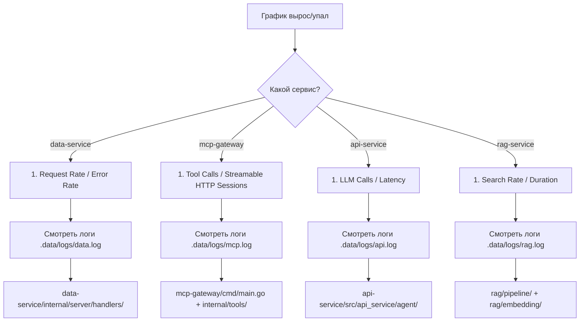

# 📊 Мониторинг & Observability Helperium

> Полное руководство. Три уровня observability:
> 1. **Structured logging** — JSON-логи каждого сервиса (slog / structlog)
> 2. **Prometheus /metrics** — числовые счётчики и гистограммы
> 3. **Grafana дашборд** — визуализация метрик (12+ панелей)
> 4. **Distributed tracing** — OTel → Tempo (+ Loki для логов)

Уровни 2–4 — **опциональны** и не влияют на работу сервисов: они запускаются
и работают без Prometheus/Grafana. Мониторинг поднимается отдельно.

---

> Единый док по мониторингу (метрики, PromQL, панели Grafana, алерты). Карта доков — в [AGENTS.md](../AGENTS.md) §Карта документации.

## Быстрый старт

```bash
# 1. Запустить сервисы (нативно)
./scripts/dev.sh start
# или целиком через stack.sh (сервисы + инфраструктура)
./scripts/stack.sh up

# 2. Запустить мониторинг
docker compose --profile monitoring up -d        # Prometheus + Grafana
docker compose --profile tracing up -d           # otel-collector + Tempo
docker compose --profile logging up -d           # Loki + Promtail
# или всё сразу:
./scripts/stack.sh up

# 3. Проверить
./scripts/stack.sh check
```

| Сервис | URL | Логин |
|---|---|---|
| Grafana | http://127.0.0.1:3000 | admin / admin |
| Prometheus | http://127.0.0.1:9090 | — |
| Tempo (traces) | :3200 HTTP / :4317 gRPC | — |
| Loki (logs) | :3100 | — |
| otel-collector | :4318 (OTLP HTTP) | — |

### Остановка

```bash
docker compose stop prometheus grafana
# или полностью:
docker compose down
```

---

## Архитектура

### Метрики (Prometheus + Grafana)

```
┌───────────────────────────────────────────────────────────────┐
│                        Docker (colima)                        │
│                                                               │
│  ┌──────────────┐      ┌────────────────┐                     │
│  │  Prometheus  │      │    Grafana     │                     │
│  │  :9090       │◄─────│  :3000         │                     │
│  └──────┬───────┘      └────────────────┘                     │
│         │  scrape via host.docker.internal (15s)              │
│         ▼                                                     │
│  ┌────────────────────────────────────────────────────┐       │
│  │          Нативные сервисы (dev.sh)                 │       │
│  │  api:8081  mcp:8083  data:8084  admin:8085         │       │
│  │  rag:8082  web:8080   (каждый на /metrics)         │       │
│  └────────────────────────────────────────────────────┘       │
└───────────────────────────────────────────────────────────────┘
```

**Ключевой момент:** Prometheus scraпит сервисы через `host.docker.internal`,
потому что сервисы запущены **нативно** (вне Docker). Если сервисы тоже
в Docker — таргеты были бы `data-service:8084` и т.д.

### Tracing (OTel → Tempo) + Logging (Loki)

```
Python (web, api, rag) ─┐
                        ├─ OTLP HTTP (4318) → otel-collector (batch 100ms/512)
Go (data, mcp, admin) ──┘                          │
                                                   │ OTLP HTTP
                                                   ▼
                                              Tempo (:3200) — traces store
                                                   │
Логи: .data/logs/*.log ─→ Promtail (:9080) ──→  Loki (:3100) — logs store
                                                   │
Дербидж: все три источника ──→ Grafana (:3000)  admin/admin
```

**Graceful degradation:** если otel-collector не запущен — сервисы работают,
ошибки логируются как `WARNING`; `OTEL_ENABLED=false` полностью отключает
OpenTelemetry; отсутствующие пакеты не ломают сервис.

---

## Панели дашборда — что значат и куда смотреть

### 🟢 Service Health

| Панель | Что показывает | Норма | Тревога |
|---|---|---|---|
| Data Service | UP/DOWN по `up{job="data-service"}` | ✅ UP | ❌ DOWN |
| MCP Gateway | UP/DOWN | ✅ UP | ❌ DOWN |
| API Service | UP/DOWN | ✅ UP | ❌ DOWN |
| Admin Dashboard | UP/DOWN | ✅ UP | ❌ DOWN |
| RAG Service | UP/DOWN | ✅ UP | ❌ DOWN |
| Web Proxy | ⚠️ панель не привязана к реальной метрике (`vector(0)`; web не скрейпится в prometheus.yml) | — | — |

**При DOWN:** `./scripts/dev.sh status` / `docker ps`, смотреть `.data/logs/*.log`.

### 📡 Data Service

| Панель | Метрика | Ед.изм. | Норма | Тревога |
|---|---|---|---|---|
| Request Rate | `rate(data_requests_total[1m])` | req/s | <50 | >200 |
| Avg DB Query Duration | `rate(data_db_query_duration_ms_sum[1m]) / rate(data_db_query_duration_ms_count[1m])` | ms | <10ms | >50ms → >500ms |
| Error Rate (4xx+5xx) | `rate(data_requests_total{status=~"4..|5.."}[1m])` | req/s | <1% | >5% |
| Request Duration (p99) | `histogram_quantile(0.99, sum(rate(data_request_duration_ms_bucket[5m])) by (le))` | ms | <100ms | >200ms → >500ms |

**Где копать при аномалиях:**
- **Рост длительности** → `services/data-service/internal/server/tenant.go` (рутер), `services/data-service/internal/datasource/postgres_adapter.go` (PG-запросы)
- **Ошибки 404** → неверный путь/entity в конфиге tenant'а `services/helperium-go/config/types.go`
- **Ошибки 500** → баг в generic-хендлере `services/data-service/internal/runtime/handlers/default.go`

### 🔌 MCP Gateway

| Панель | Метрика | Ед.изм. | Норма | Тревога |
|---|---|---|---|---|
| Tool Calls Rate | `rate(mcp_tool_calls_total[1m])` | req/s | <10 | >50 |
| Active Streamable HTTP Sessions | `sum(mcp_sessions_active)` | шт | <100 | >500 |
| Rate Limit Hits | `rate(mcp_rate_limit_hits_total[5m])` | req/s | 0 | >0 |
| Errors (tool calls) | `mcp_tool_calls_total{status!="ok"}` | шт | 0 | >0 |

**Где копать при аномалиях:**
- **Rate limit >0** → увеличить RPS/burst в `services/mcp-gateway/cmd/ratelimit.go`
- **Сессии падают** → `services/mcp-gateway/cmd/main.go` (Streamable HTTP lifecycle hooks, idle TTL)
- **Tool call errors** → `services/mcp-gateway/internal/tools/` (маппинг инструментов), `services/mcp-gateway/internal/httpclient/client.go` (HTTP к data-service)

### 🧠 API — LLM & Chat

| Панель | Метрика | Ед.изм. | Норма | Тревога |
|---|---|---|---|---|
| LLM Calls Rate | `rate(llm_calls_total[1m])` | req/s | <1 | >5 |
| LLM Duration (avg) | `rate(llm_duration_ms_sum[1m]) / rate(llm_duration_ms_count[1m]) / 1000` | s | <5s | >15s → >30s |
| Token Usage Rate | `rate(llm_token_usage_total[1m])` | tok/s | — | — |
| LLM Cost | `rate(llm_cost_total[1m])` | USD/min | <$0.01 | >$0.10 |
| Active Chat Sessions | `max(chat_sessions_total)` | шт | — | — |
| Abuse Blocks | `rate(abuse_blocked_total[1m])` | req/s | 0 | >0 |
| Chat Message Rate | `rate(chat_messages_total[1m])` | msg/s | — | — |
| Backlog Queue | `rate(backlog_records_total[15m])` | шт | 0 | >10 |

**Где копать при аномалиях:**
- **LLM долгий** → `services/api-service/src/api_service/agent/orchestrator.py` (цикл _run_turn), провайдер LiteLLM
- **Cost растёт** → сменить модель/провайдера в `services/api-service/src/api_service/agent/litellm_provider.py`
- **Abuse blocks** → `services/api-service/src/api_service/guardrails.py` (класс `GuardChecker`, prompt injection, repeated text)
- **Backlog растёт** → worker'ы не успевают, `services/api-service/src/api_service/backlog.py`

### 📄 RAG Service

| Панель | Метрика | Ед.изм. | Норма | Тревога |
|---|---|---|---|---|
| Documents & Chunks | `rag_documents_total`, `rag_chunks_total` | шт | — | — |
| ChromaDB Size | `rag_chroma_size_bytes / 1048576` | MB | <500 | >1000 |
| Search Rate | `rate(rag_search_duration_ms_count[1m])` (панель использует duration-count как прокси; метрика `rag_searches_total` есть в коде, но не за этой панелью) | req/s | <10 | >50 |
| Search p95 Duration | `histogram_quantile(0.95, ...)` | ms | <100 | >500 |
| Cache Hit Ratio | `rate(rag_cache_hits_total[5m]) / rate(rag_cache_hits_total + rag_cache_misses_total)[5m]` | % | >50% | <30% |
| Import Duration (avg) | `rate(rag_import_duration_ms_sum[1m]) / rate(rag_import_duration_ms_count[1m]) / 1000` | s | <2s | >10s |
| Search Error Rate | `rate(rag_searches_total{status="error"}[5m])` | err/s | 0 | >0 |

**Где копать при аномалиях:**
- Search долгий → `rag/pipeline/pipeline.py`, `rag/embedding/`
- Cache ratio низкий → частые уникальные запросы, нормально
- Import долгий → `rag/pipeline/pipeline.py` (чанкинг), размер документа
- Search errors → ChromaDB connection, `rag/cache/local.py`

### ⚙️ Admin Dashboard

| Панель | Метрика | Ед.изм. | Норма | Тревога |
|---|---|---|---|---|
| Request Rate | `rate(admin_requests_total[1m])` | req/s | <5 | >20 |
| Admin Error Rate | `rate(admin_requests_total{status=~"4..|5.."}[5m])` | err/s | 0 | >0 |

---

## Метрики — справочник PromQL

### data-service (`:8084/metrics`)

| Метрика | Тип | Лейблы | Описание |
|---|---|---|---|
| `data_requests_total` | Counter | `operation, status, entity, tenant` | Все HTTP-запросы |
| `data_request_duration_ms` | Histogram | `operation, entity` | Длительность HTTP |
| `data_db_query_duration_ms` | Histogram | `tenant` | Длительность SQL-запроса |

### mcp-gateway (`:8083/metrics`)

| Метрика | Тип | Лейблы | Описание |
|---|---|---|---|
| `mcp_tool_calls_total` | Counter | `tool, status, tenant` | Вызовы MCP-инструментов |
| `mcp_sessions_active` | Gauge | `tenant_scope` | Активные Streamable HTTP сессии для разрешённого tenant scope |
| `mcp_rate_limit_hits_total` | Counter | `tenant` | Заблокированные rate-limiter'ом |

### api-service (`:8081/metrics`)

| Метрика | Тип | Лейблы | Описание |
|---|---|---|---|
| `chat_sessions_total` | Counter | — | Созданные сессии |
| `chat_messages_total` | Counter | `status` | Сообщения (ok/blocked/error) |
| `llm_calls_total` | Counter | `model, provider` | Вызовы LLM |
| `llm_duration_ms` | Histogram | `model` | Длительность LLM-вызова |
| `llm_token_usage_total` | Counter | `type` | Токены (prompt/completion/total) |
| `llm_cost_total` | Counter | `model, provider, tenant_id` | Стоимость LLM в USD |
| `abuse_blocked_total` | Counter | `reason` | Блокировки анти-абуза |
| `embed_widget_requests_total` | Counter | `endpoint` | Запросы к /embed/* |
| `backlog_records_total` | Counter | `type` | Всего бэклог-задач (turn_start, llm_call, tool_call, tool_result) |

### rag-service (`:8082/metrics`)

| Метрика | Тип | Лейблы | Описание |
|---|---|---|---|
| `rag_documents_total` | Gauge | — | Всего документов в SQLite |
| `rag_chunks_total` | Gauge | — | Всего чанков в SQLite |
| `rag_chroma_size_bytes` | Gauge | — | Размер ChromaDB на диске |
| `rag_searches_total` | Counter | `status` | Поисковых запросов |
| `rag_search_duration_ms` | Histogram | — | Длительность поиска |
| `rag_cache_entries` | Gauge | — | Размер кэша поиска |
| `rag_cache_hits_total` | Counter | — | Попаданий в кэш |
| `rag_cache_misses_total` | Counter | — | Промахов кэша |
| `rag_import_duration_ms` | Histogram | — | Длительность импорта документа |

### admin-dashboard (`:8085/metrics`)

| Метрика | Тип | Лейблы | Описание |
|---|---|---|---|
| `admin_requests_total` | Counter | `path, status` | HTTP-запросы админки |
| `admin_abuse_config_changes_total` | Counter | `scope` | Изменения anti-abuse конфига |

---

## Tracing: сервисы и идентификация

| Сервис | Язык | Имя в Tempo | OTel endpoint |
|---|---|---|---|
| Web | Python | `helperium-demo-web` | `OTEL_EXPORTER_OTLP_ENDPOINT` (default: `http://localhost:4318`) |
| API | Python | `helperium-api-service` | тот же |
| RAG | Python | `helperium-rag-service` | тот же |
| Data | Go | `helperium-data-service` | env `OTEL_EXPORTER_OTLP_ENDPOINT` |
| MCP | Go | `helperium-mcp-gateway` | env `OTEL_EXPORTER_OTLP_ENDPOINT` |
| Admin | Go | `helperium-admin-dashboard` | env `OTEL_EXPORTER_OTLP_ENDPOINT` |

### Cross-service trace propagation

**traceparent header** пропагируется автоматически:

- **Python → Python**: `HTTPXClientInstrumentor` в `helperium_sdk.tracing` добавляет `traceparent` на исходящие HTTPX запросы
- **Python → Go**: Web прокси прокидывает все заголовки через `_get_proxy_headers()` → Go `tracing.Middleware` создаёт child span
- **Go → Go**: `tracing.Middleware` прокидывает контекст через HTTP-клиент в data-service

**Correlation ID** (`X-Correlation-ID`) остаётся для обратной совместимости.

### Explore (Tempo)

```
# Найти трейсы по сервису
Grafana → Explore → Tempo → Search:
  Service Name: helperium-data-service

# TraceQL запрос напрямую
{ .service.name = "helperium-mcp-gateway" }

# По trace ID (из логов)
<trace ID> → Explore → Tempo → вставить в поле
```

### Explore (Loki)

```
# Все логи
{job="native-services"}

# Только ошибки
{job="native-services"} |= "ERROR"

# По trace ID (автоматический переход в Tempo из лога)
{job="native-services"} |= "trace_id": "abc
```

**Derived fields**: в Loki настроен парсинг `"trace_id":"([a-f0-9]{32})"` —
клик по TraceID в логе открывает трейс в Tempo.

_Примечание:_ `trace_id` инжектится в логи Go (slog) и Python (structlog через
log_config). Если `trace_id` пустой — `OTEL_ENABLED=false` или запрос без активного span.

---

## Переменные окружения

| Переменная | По умолчанию | Описание |
|---|---|---|
| `OTEL_ENABLED` | `true` | Отключить tracing (`false`) |
| `OTEL_EXPORTER_OTLP_ENDPOINT` | `http://localhost:4318` | OTLP HTTP endpoint |
| `OTEL_SERVICE_NAME` | `helperium-{service_name}` | Имя сервиса в Tempo |

---

## Алерты (TODO)

Пример алерта для долгих DB запросов (Grafana Alerting):

```yaml
- name: Slow DB Queries
  alert: avg_over_time(rate(data_db_query_duration_ms_sum[5m]) / rate(data_db_query_duration_ms_count[5m])[5m]) > 1000
  for: 5m
  message: "DB queries avg >1s for 5 minutes on data-service"
```

---

## Поиск виновника проблем



---

## Диагностика: "No Data" на панели

### Prometheus не видит сервис
1. http://127.0.0.1:9090/targets — статус (UP / DOWN)
2. Если DOWN: сервис не запущен или порт другой
3. Если UP но No Data: метрика никогда не вызывалась

### Метрика не растёт
```bash
curl -s http://127.0.0.1:8081/metrics | grep -E '^[a-z]'
curl -s 'http://127.0.0.1:8084/metrics?tenant=default' | grep data_requests_total
# В Prometheus: http://127.0.0.1:9090/graph?g0.expr=rate(data_requests_total[1m])
```

### Панель с No data — это нормально
- `mcp_sessions_active` — нет активных SSE-сессий
- `mcp_rate_limit_hits_total` — не было rate-limit хитов
- `llm_*` — не было LLM-вызовов
- `abuse_blocked_total` — не было abuse-блокировок
- `admin_abuse_config_changes_total` — не меняли конфиг

Открой чат и позадавай вопросы — метрики появятся.

### Проверка что трейсы/логи доходят

```bash
# Tempo
curl -s 'http://127.0.0.1:3200/api/search?q={}&limit=10'
# Prometheus targets
curl -s 'http://127.0.0.1:9090/api/v1/targets'
# Loki
curl -s 'http://127.0.0.1:3100/loki/api/v1/query_range' \
  --data-urlencode 'query={job="native-services"}' \
  --data-urlencode 'limit=5'
```

---

## Как это редактировать

### Добавить панель в дашборд

1. Открыть `docker/grafana/dashboards/helperium-overview.json`
2. Добавить объект в массив `panels[]`
3. `gridPos` — расположение на сетке (12 колонок, каждая строка 8h)
4. `targets[].expr` — PromQL-запрос
5. Рестарт: `docker compose restart grafana`

### Добавить новую метрику в сервис

**Go (data-service / mcp-gateway / admin-dashboard):**
1. Определить в `helperium-go/pkg/metrics/metrics.go`: `prometheus.NewCounterVec(...)`
2. Зарегистрировать в `RegisterMetrics()`
3. Вызвать `.WithLabelValues(...).Inc()` / `.Observe()` в нужном месте

**Python (api-service):**
1. Определить в `api-service/src/api_service/prometheus_metrics.py`
2. Импортировать и вызывать `.inc()` / `.observe()`
3. Метрика появится на `/metrics` автоматически

### Поменять Prometheus-конфиг

`docker/prometheus/prometheus.yml`:

```yaml
scrape_configs:
  - job_name: 'data-service'
    metrics_path: '/metrics'
    params:
      tenant: ['default']           # data-service требует tenant
    static_configs:
      - targets: ['host.docker.internal:8084']
```

---

## Где что лежит

| Файл | Назначение |
|---|---|
| `docker/prometheus/prometheus.yml` → `infra/docker/prometheus/prometheus.yml` | Конфигурация Prometheus (таргеты) |
| `docker/grafana/datasources/datasource.yml` → `infra/docker/grafana/datasources/datasource.yml` | Provisioned datasource |
| `docker/grafana/dashboards/helperium-overview.json` → `infra/docker/grafana/dashboards/helperium-overview.json` | **Дашборд** (этот файл) |
| `docker/grafana/dashboards/dashboard.yml` → `infra/docker/grafana/dashboards/dashboard.yml` | Provider для автозагрузки |
| `.data/logs/{svc}.log` | JSON-логи сервисов |
| `.env` | ADMIN_API_TOKEN (для RAG /admin/*), ADMIN_TOKEN |
| `doc/monitoring.md` | **Эта документация** |

---
## Проверка готовности observability для публичной demo

Текущий monitoring-контур является рабочим single-host стеком, но не полноценной production observability-платформой. Prometheus, Grafana, Loki, Promtail, Tempo и OTEL Collector запускаются через compose-профили `monitoring`, `logging` и `tracing`; порты привязаны к `127.0.0.1`, поэтому наружу они не публикуются по умолчанию.

В core compose tracing теперь выключен по умолчанию (`OTEL_ENABLED=false`). Для включения tracing нужно задать `OTEL_ENABLED=true`; endpoint по умолчанию внутри compose указывает на `http://otel-collector:4318`. Prometheus и Grafana используют имена сервисов compose (`data-service`, `mcp-gateway`, `api`, `admin-dashboard`, `prometheus`, `tempo`, `loki`), а не `host.docker.internal`, что важно для запуска внутри Docker-сети.

Практическое покрытие хорошее для диагностики: есть health checks, Prometheus-метрики запросов, длительности DB/LLM/tool операций, rate-limit hits, abuse blocks, backlog, structured logs, корреляционные и trace IDs, Loki и Tempo. При этом в dashboard есть намеренно пустая панель `Web Proxy`, а production alerts пока не заведены: раздел ниже содержит только пример. Перед публичным трафиком минимум следует добавить алерты на недоступность core services, HTTP 5xx, rate-limit saturation, LLM/tool latency и отсутствие scrape targets.

Проверка:

```bash
docker-compose -f infra/docker-compose.yml config
# базовый стек
docker-compose -f infra/docker-compose.yml up -d
# стек с мониторингом и tracing
docker-compose -f infra/docker-compose.yml --profile monitoring --profile tracing up -d
```

**Last verified:** 2026-08-18 (working tree after `6cdb51f`) — Streamable HTTP gateway metrics, lifecycle-backed active sessions label and Grafana queries reviewed locally.
